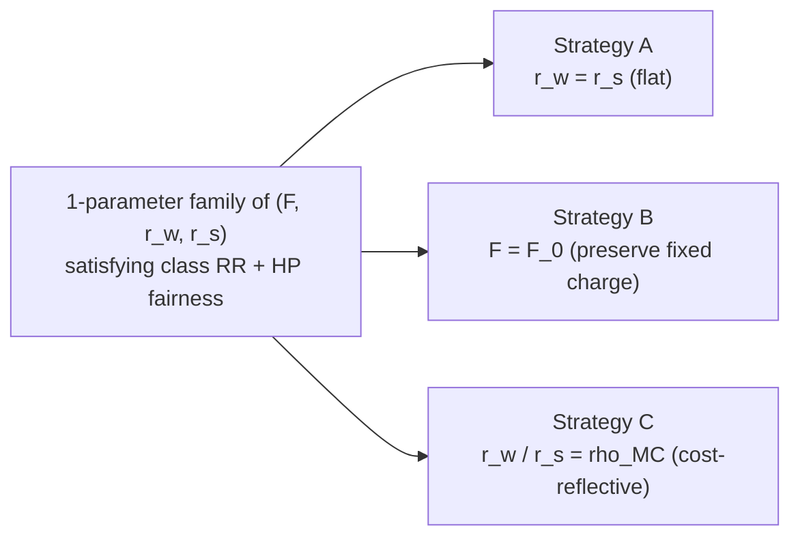

# Fair default rate design: math and closed-form strategies

How to redesign the residential default tariff (a single tariff that applies to **every** residential customer) so that it eliminates the heat-pump cross-subsidy measured by the Bill Alignment Test, while still collecting the class revenue requirement. Three closed-form strategies — fixed-charge only, seasonal-rates only, and a combined cost-reflective design — plus a uniqueness analysis answering the question "for any given fixed charge, how many seasonal rate pairs satisfy the constraints?".

This is the math behind issue #398 and the upcoming `utils/mid/compute_fair_default_inputs.py` / `utils/mid/create_fair_default_tariff.py` modules.

---

## 1. Why a default tariff (and not a HP-specific one)

Existing seasonal-discount tariffs (`utils/mid/compute_seasonal_discount_inputs.py`) eliminate the HP cross-subsidy by giving HP customers a different tariff from non-HP customers. That works analytically but raises practical and regulatory problems: utilities have to identify HP customers, defend a separate class in rate cases, and maintain dual billing systems. A **fair default** tariff is a single tariff applied to the whole residential class whose structure is chosen so that the HP subclass nets to zero cross-subsidy automatically.

The price of singularity is a smaller design space. With one tariff for everyone, the only knobs are:

- the fixed charge $F$ (\$/customer/month),
- the volumetric rate(s) $r$ (flat) or $(r_w, r_s)$ (winter/summer seasonal).

The question is whether those knobs have enough flexibility to satisfy two constraints simultaneously — class revenue sufficiency and HP cross-subsidy elimination — and, if so, how to choose among the family of solutions when there are more knobs than constraints.

---

## 2. Setup and notation

All quantities are observed in CAIRO outputs from a calibrated baseline run (e.g. `run-1` for delivery-only, `run-2` for delivery+supply); see `context/code/orchestration/run_orchestration.md` for what each run produces.

**Customer-level (per building $i$):**

- $\omega_i$ — sample weight from `customer_metadata.csv` (`weight` column)
- $L_{i,h}$ — hourly grid-consumption load (kWh) at hour $h$, from `scan_resstock_loads`
- $E_i = \sum_h L_{i,h}$ — annual kWh
- $W_i = \sum_{h \in \mathcal{H}_w} L_{i,h}$ — winter kWh
- $U_i = \sum_{h \in \mathcal{H}_s} L_{i,h}$ — summer kWh, with $E_i = W_i + U_i$
- $b_i$ — current annual electric bill (\$) from `bills/elec_bills_year_target.csv`
- $X_i$ — per-customer cross-subsidy (\$/yr) from `cross_subsidization/cross_subsidization_BAT_values.csv`, column chosen by `cross_subsidy_col` (default `BAT_percustomer`); see `context/methods/bat_mc_residual/bat_lrmc_residual_allocation_methodology.md` for the underlying decomposition.

The seasonal split $\mathcal{H}_w, \mathcal{H}_s$ is the per-utility winter/summer month set defined in the periods YAML (`utils/pre/season_config.py`), the same one used by the seasonal-discount workflow.

**Sign convention for $X_i$:** $X_i > 0$ means customer $i$ is **overcharged** under the current tariff (their bill exceeds their allocated cost). This matches the existing `compute_subclass_seasonal_discount_inputs` code, where a positive subclass cross-subsidy $X_S$ produces a positive winter discount that reduces HP bills. To eliminate the cross-subsidy, the new tariff must reduce subclass S's total bill by $X_S$.

**Class and subclass aggregates** (subclass $S$ = HP customers, defined by `group_col=has_hp`, `subclass_value=true`):

$$N = \sum_i \omega_i, \quad E = \sum_i \omega_i E_i, \quad W = \sum_i \omega_i W_i, \quad U = \sum_i \omega_i U_i$$

$$N_S = \sum_{i \in S} \omega_i, \quad E_S = \sum_{i \in S} \omega_i E_i, \quad W_S = \sum_{i \in S} \omega_i W_i, \quad U_S = \sum_{i \in S} \omega_i U_i$$

$$B = \sum_i \omega_i b_i, \quad B_S = \sum_{i \in S} \omega_i b_i, \quad X_S = \sum_{i \in S} \omega_i X_i$$

**Derived targets:**

- $RR \equiv B$ — class revenue requirement. Because the baseline default tariff is calibrated to recover RR, the weighted-sum of current bills equals RR by construction.
- $TC_S \equiv B_S - X_S$ — HP fair allocated cost. By the cross-subsidy sign convention, this is what the HP subclass *should* pay if the residual were allocated by the BAT residual method (`BAT_percustomer`, etc.).

The base tariff's existing fixed charge $F_0$ is read from the calibrated URDB JSON via `_extract_fixed_charge_from_urdb` (in `utils/mid/compute_subclass_rr.py`).

---

## 3. The two constraints

For any candidate new default tariff with fixed charge $F$ and seasonal rates $(r_w, r_s)$, the class and subclass annual bills are linear in the parameters:

$$B^{\text{new}} = 12 F N + r_w W + r_s U$$

$$B_S^{\text{new}} = 12 F N_S + r_w W_S + r_s U_S$$

The two design constraints are:

**(C1) Class revenue sufficiency** — collect the same total revenue as the calibrated baseline:

$$\boxed{12 F N + r_w W + r_s U = RR}$$

**(C2) HP cross-subsidy elimination** — charge HP exactly their fair allocated cost:

$$\boxed{12 F N_S + r_w W_S + r_s U_S = TC_S}$$

Two linear equations in three unknowns $(F, r_w, r_s)$. With three knobs and two constraints there is generically a one-parameter family of solutions. The three strategies below are three different ways of closing that one degree of freedom.

---

## 4. Strategy A — fixed-charge only (flat volumetric)

Force a single flat volumetric rate $r_w = r_s = r$. The system becomes 2 unknowns ($F, r$), 2 equations:

$$\begin{pmatrix} 12 N & E \\ 12 N_S & E_S \end{pmatrix} \begin{pmatrix} F \\ r \end{pmatrix} = \begin{pmatrix} RR \\ TC_S \end{pmatrix}$$

Determinant: $\Delta_A = 12(N E_S - N_S E)$. By Cramer's rule:

$$F^*_A = \frac{RR \cdot E_S - TC_S \cdot E}{12(N E_S - N_S E)}, \qquad r^*_A = \frac{TC_S \cdot N - RR \cdot N_S}{N E_S - N_S E}$$

Equivalently, expressing as a delta from the baseline calibrated tariff $(F_0, r_0)$ and noting that $RR = 12 F_0 N + r_0 E$, $B_S = 12 F_0 N_S + r_0 E_S$:

$$\Delta F_A = F^*_A - F_0 = \frac{-X_S}{12(N_S - N \cdot E_S/E)}, \qquad \Delta r_A = r^*_A - r_0 = \frac{X_S}{E_S - E \cdot N_S/N}$$

**Existence and uniqueness.** The system has a unique solution iff $\Delta_A \ne 0$, i.e.

$$\frac{E_S}{N_S} \ne \frac{E}{N}$$

— HP per-customer kWh differs from the class-wide average. This is essentially always true: HP customers have higher annual electric consumption than non-HP customers (electrification of heating shifts therms onto kWh).

**Sign intuition.** If HP customers consume more kWh per customer than the class average ($E_S/N_S > E/N$) and are currently overcharged ($X_S > 0$), then $\Delta F_A < 0$ and $\Delta r_A > 0$: the fix is to *raise* the volumetric rate and *cut* the fixed charge. Lower fixed charge benefits HP relatively more (because the bill reduction is the same dollars for everyone, but HP's kWh-volume is larger), and a higher volumetric rate hurts everyone proportionally to kWh — net effect transfers dollars from non-HP to HP.

**Failure mode.** If the closed-form $F^*_A < 0$ (or below a regulatory floor like \$5/month), the strategy is infeasible at face value; report the floor-clipped $F$ and the residual cross-subsidy that remains.

---

## 5. Strategy B — seasonal rates only ($F = F_0$ preserved)

Hold the fixed charge at the calibrated baseline value $F_0$. The remaining unknowns are the two seasonal rates $(r_w, r_s)$:

$$\begin{pmatrix} W & U \\ W_S & U_S \end{pmatrix} \begin{pmatrix} r_w \\ r_s \end{pmatrix} = \begin{pmatrix} RR - 12 F_0 N \\ TC_S - 12 F_0 N_S \end{pmatrix}$$

Determinant: $D = W U_S - W_S U$. By Cramer's rule:

$$r^*_{w,B} = \frac{(RR - 12 F_0 N) U_S - (TC_S - 12 F_0 N_S) U}{D}$$

$$r^*_{s,B} = \frac{(TC_S - 12 F_0 N_S) W - (RR - 12 F_0 N) W_S}{D}$$

In delta form (writing $\Delta r_{w,B} = r^*_{w,B} - r_0$, $\Delta r_{s,B} = r^*_{s,B} - r_0$, where $r_0$ is the baseline equivalent flat rate $(RR - 12 F_0 N)/E$ for a flat baseline):

$$\Delta r_{w,B} = \frac{X_S \cdot U}{D}, \qquad \Delta r_{s,B} = \frac{-X_S \cdot W}{D}$$

(when the baseline is already seasonal, replace $r_0$ with $r_{w,0}$ and $r_{s,0}$ on the right-hand side; the structure of the deltas is unchanged because (C1) and (C2) are linear in absolute rates).

**Existence and uniqueness.** The system has a unique solution iff $D \ne 0$, i.e.

$$\frac{W_S}{W} \ne \frac{U_S}{U} \quad \Leftrightarrow \quad \frac{W_S}{E_S} \ne \frac{W}{E}$$

— HP's winter share of annual consumption differs from the class winter share. Always true with heat pumps: HP customers are dramatically winter-heavier than the class average (their winter kWh is dominated by heating; non-HP customers run on resistance, gas, or oil for heat and have flatter seasonality on the electric meter).

**Sign intuition.** If HP customers are winter-heavy relative to the class ($W_S/E_S > W/E$, equivalently $D > 0$ in the natural orientation) and are currently overcharged ($X_S > 0$), then $\Delta r_{w,B} > 0$ and $\Delta r_{s,B} < 0$ would actually *worsen* HP's bill in winter — but here the math reverses: raising $r_w$ collects extra revenue from the whole class (which is class-average less winter-heavy than HP), while cutting $r_s$ refunds the most kWh to non-HP. The redistribution flows away from HP. Re-examining the formula in the overcharge convention with the assumption that current cross-subsidy comes from non-cost-reflective seasonality, the signs of $\Delta r_{w,B}$ and $\Delta r_{s,B}$ depend on the sign of $D$ and the seasonal asymmetry; the formulas above are correct and produce the algebraically unique answer.

**Failure mode.** Negative seasonal rates. The closed form does not enforce $r_w, r_s \ge 0$. If, say, $r^*_{w,B} < 0$ — meaning the algebraically-required winter rate is a *credit* — we cannot legally publish it. Two options:

1. Clip the negative rate to zero, recompute the other rate from the class RR constraint alone, and report the residual cross-subsidy that remains. The closed-form residual is

   $$X_S^{\text{residual}} = (\text{algebraic } r_w \text{ shortfall}) \cdot W_S + (\text{recomputed } r_s \text{ delta}) \cdot U_S$$

   reported alongside the tariff so downstream tooling can flag the partial-elimination case.

2. Fall back to Strategy A (the discriminant for A is independent of $D$, so one strategy may be feasible when the other is not).

---

## 6. Strategy C — combined, with a cost-reflective seasonal ratio

Use all three knobs $(F, r_w, r_s)$ but close the one remaining degree of freedom by enforcing a **cost-reflective** seasonal ratio:

$$\frac{r_w}{r_s} = \rho_{MC}$$

where $\rho_{MC}$ is the load-weighted marginal cost ratio between winter and summer, computed on system MC and class load following the methodology in `context/methods/tou_and_rates/cost_reflective_tou_rate_design.md`:

$$\rho_{MC} = \frac{\overline{MC}_w}{\overline{MC}_s} = \frac{\sum_{h \in \mathcal{H}_w} MC_h L_h \big/ \sum_{h \in \mathcal{H}_w} L_h}{\sum_{h \in \mathcal{H}_s} MC_h L_h \big/ \sum_{h \in \mathcal{H}_s} L_h}$$

Substitute $r_w = \rho_{MC} r_s$ into (C1) and (C2). Defining $\beta = \rho_{MC} W + U$ and $\alpha = \rho_{MC} W_S + U_S$:

$$\begin{pmatrix} 12 N & \beta \\ 12 N_S & \alpha \end{pmatrix} \begin{pmatrix} F \\ r_s \end{pmatrix} = \begin{pmatrix} RR \\ TC_S \end{pmatrix}$$

Determinant: $\Delta_C = 12(N \alpha - N_S \beta)$. Solution:

$$F^*_C = \frac{\alpha \cdot RR - \beta \cdot TC_S}{12(N \alpha - N_S \beta)}, \qquad r^*_{s,C} = \frac{N \cdot TC_S - N_S \cdot RR}{N \alpha - N_S \beta}, \qquad r^*_{w,C} = \rho_{MC} \cdot r^*_{s,C}$$

**Existence and uniqueness.** Unique iff $\Delta_C \ne 0$, equivalently $\alpha/N_S \ne \beta/N$ — the per-customer "ratio-weighted" kWh of HP differs from that of the class. With $\rho_{MC} > 0$ this reduces to a linear combination of the Strategy A and Strategy B nondegeneracy conditions and effectively always holds in practice.

**Why this is the right closure.** Among the one-parameter family of (C1,C2)-feasible tariffs, this point is the one whose seasonal differential matches the cost-causation differential. It is the single member of the family that simultaneously (i) collects RR, (ii) zeros the HP cross-subsidy, and (iii) sends the seasonal price signal that an ideal cost-reflective two-period tariff would send. It is the natural "best of both worlds" point on the line of feasible tariffs.

---

## 7. The one-parameter family and uniqueness theorem

The user's question — "for a given fixed charge, are there zero, one, or infinitely many seasonal rate pairs that satisfy the two constraints?" — has a clean algebraic answer.

**Theorem.** Fix any value of $F$. Then (C1) and (C2) restricted to the unknowns $(r_w, r_s)$ form a $2 \times 2$ linear system

$$\begin{pmatrix} W & U \\ W_S & U_S \end{pmatrix} \begin{pmatrix} r_w \\ r_s \end{pmatrix} = \begin{pmatrix} RR - 12 F N \\ TC_S - 12 F N_S \end{pmatrix}$$

with determinant $D = W U_S - W_S U$. There is **exactly one** solution $(r_w, r_s)$ whenever $D \ne 0$, **zero** solutions when $D = 0$ and the right-hand side is inconsistent, and **infinitely many** when $D = 0$ and the right-hand side is consistent. Generically (with HP seasonal share differing from class seasonal share) $D \ne 0$, so the answer is **exactly one**.

**Geometric picture.** As $F$ varies over $\mathbb{R}$, the unique solution $(r_w(F), r_s(F))$ traces an affine line in 3-space. Strategies A, B, C are three named points on this line:

Other reasonable closures (regulatorily fix $F$ at \$10/month, fix the winter rate at the marginal energy cost, enforce $r_s \ge $ a fuel-cost floor, etc.) give still other named points on the same line. The framework is the same: pick any one extra constraint to close the system, get a unique closed-form $(F, r_w, r_s)$.

**Why "exactly one" matters.** It tells us this is not a problem that needs a numerical optimizer or a search. Any policy choice that adds one scalar constraint immediately yields a closed-form solution by Cramer's rule. The hard problem is choosing the right closure (A vs B vs C, or some hybrid), not solving the equations once it's chosen.

---

## 8. Feasibility region

The closed-form solutions are real numbers; we still need them to be physically meaningful as a tariff. The feasibility constraints are:

$$F \ge F_{\min}^{\text{reg}} \ge 0, \qquad r_w \ge 0, \qquad r_s \ge 0$$

(with possibly $F_{\min}^{\text{reg}} > 0$ representing a regulatory floor on the fixed charge).

Along the one-parameter family $\{(F, r_w(F), r_s(F))\}$, each non-negativity constraint is a linear inequality in $F$, defining a half-line. The intersection is an interval $F \in [F_{\min}, F_{\max}]$ (possibly empty). Concretely:

- $r_w(F) = r_w(0) + a_w F$ for some slope $a_w$, so $r_w \ge 0$ becomes $F \le -r_w(0)/a_w$ (or $\ge$, depending on sign of $a_w$).
- Similarly for $r_s(F)$.
- $F \ge F_{\min}^{\text{reg}}$ closes the lower end.

The output of `utils/mid/compute_fair_default_inputs.py` will report $[F_{\min}, F_{\max}]$ explicitly so downstream sensitivity analysis can plot the feasible family. If $F^*_A$, $F_0$, or $F^*_C$ falls outside $[F_{\min}, F_{\max}]$, the corresponding strategy is infeasible without rate clipping.

---

## 9. Worked example (illustrative)

Numbers are stylized to show how the formulas behave; an actual RIE example using current run-1 outputs will be filled in once the modules land.

Suppose, for a residential class with $N = 400{,}000$ customers:

- Class: $E = 4 \cdot 10^9$ kWh, $W = 2.4 \cdot 10^9$ (winter share 60%), $U = 1.6 \cdot 10^9$
- HP subclass: $N_S = 40{,}000$, $E_S = 6 \cdot 10^8$ kWh (15% of class kWh from 10% of customers), $W_S = 4.5 \cdot 10^8$ (winter share 75%), $U_S = 1.5 \cdot 10^8$
- Calibrated baseline: $F_0 = \$15$/month, equivalent flat $r_0 = 0.16$ \$/kWh ⇒ $RR = 12 \cdot 15 \cdot 400{,}000 + 0.16 \cdot 4 \cdot 10^9 = \$712\text{M}$
- Current HP bill: $B_S = 12 \cdot 15 \cdot 40{,}000 + 0.16 \cdot 6 \cdot 10^8 = \$103.2\text{M}$
- HP overcharge from BAT: $X_S = +\$5\text{M}$ ⇒ $TC_S = \$98.2\text{M}$

Plug into the closed forms:

- **Strategy A.** $\Delta_A = 12(4 \cdot 10^5 \cdot 6 \cdot 10^8 - 4 \cdot 10^4 \cdot 4 \cdot 10^9) = 12 \cdot (2.4 - 1.6) \cdot 10^{14} = 9.6 \cdot 10^{14}$. Solving gives $F^*_A \approx \$13.96$/month, $r^*_A \approx 0.1605$ \$/kWh — a small reduction in the fixed charge and a small bump in the volumetric.
- **Strategy B** (preserve $F_0 = 15$). $D = W U_S - W_S U = 2.4 \cdot 10^9 \cdot 1.5 \cdot 10^8 - 4.5 \cdot 10^8 \cdot 1.6 \cdot 10^9 = 3.6 \cdot 10^{17} - 7.2 \cdot 10^{17} = -3.6 \cdot 10^{17}$. The signed denominators give $r^*_{w,B}$ slightly below $r_0$ and $r^*_{s,B}$ slightly above — HP's winter-heaviness is the lever.
- **Strategy C** with a stylized $\rho_{MC} = 1.4$ (winter MC 40% above summer). $\beta = 1.4 \cdot 2.4 \cdot 10^9 + 1.6 \cdot 10^9 = 4.96 \cdot 10^9$, $\alpha = 1.4 \cdot 4.5 \cdot 10^8 + 1.5 \cdot 10^8 = 7.8 \cdot 10^8$. Solve the $2 \times 2$ for $(F^*_C, r^*_{s,C})$ and recover $r^*_{w,C} = 1.4 \cdot r^*_{s,C}$.

The point is qualitative: all three closed forms are pencil-and-paper computable from the inputs CSV. The implementation just plumbs the formulas; there is no optimizer in the loop.

---

## 10. Limitations and extensions

- **Single subclass.** The framework eliminates one cross-subsidy (HP). If multiple subclasses (HP, electric resistance heat, EV-only) all need zeroing simultaneously, the constraint count grows and the design space (fixed + 2 seasonal rates) is no longer rich enough — TOU or tiered structures, or simultaneous adjustments to multiple class-wide parameters, become necessary. Multi-subclass elimination is left to a follow-up issue.
- **Flat-vs-seasonal only.** Strategies A/B/C assume a flat-or-2-period-seasonal tariff. Adding TOU within seasons (peak/off-peak) introduces more knobs and more cost-reflectiveness, but also more degrees of freedom to close. The natural extension is "Strategy D" with $(F, r_{w,\text{peak}}, r_{w,\text{off}}, r_{s,\text{peak}}, r_{s,\text{off}})$ closed by enforcing both the seasonal ratio and the within-season peak ratio against $\rho_{MC}$ and the TOU cost-causation ratios from `context/methods/tou_and_rates/cost_reflective_tou_rate_design.md`.
- **Delivery vs supply.** Run-1 outputs cover delivery; run-2 covers delivery+supply. The strategies above can be applied to either, producing `_default_fair_<strategy>.json` and `_default_fair_<strategy>_supply.json` tariffs respectively. The supply variant uses the same math with supply-only $X_S$ and supply-only baseline bills.
- **Interaction with downstream LMI discount.** Apply the LMI tier credit *after* the fair-default tariff is constructed (the LMI credit is a flat per-tier dollar discount). The fair-default math is unchanged; the LMI credit reduces realized revenue but is funded outside the class RR, consistent with the existing `utils/post/apply_ny_lmi_to_master_bills.py` workflow.
- **Calibration drift.** The closed forms assume CAIRO's calibrated bills exactly recover RR and the BAT residual exactly equals $TC_S$. In practice CAIRO's iterative calibration leaves small (sub-percent) residuals; the tariff produced from this math will need a final calibration pass, identical to the precalc step used by the seasonal-discount workflow.

---

## 11. Cross-references

**Implementation (planned):**

- [`utils/mid/compute_fair_default_inputs.py`](utils/mid/compute_fair_default_inputs.py) — emits the inputs CSV with $N, N_S, W, W_S, U, U_S, RR, B_S, X_S, \rho_{MC}$ and the closed-form $F^*_A$, $r^*_A$, $r^*_{w,B}$, $r^*_{s,B}$, $F^*_C$, $r^*_{w,C}$, $r^*_{s,C}$ plus the feasible interval $[F_{\min}, F_{\max}]$.
- [`utils/mid/create_fair_default_tariff.py`](utils/mid/create_fair_default_tariff.py) — wraps `create_flat_rate` (Strategy A) and `create_seasonal_rate` (B, C) from [`utils/pre/create_tariff.py`](utils/pre/create_tariff.py); injects the new $F$ via a small `_with_fixed_charge` helper.
- Reuses helpers from [`utils/mid/compute_subclass_rr.py`](utils/mid/compute_subclass_rr.py): `_load_subclass_cross_subsidy_inputs` (for $X_S$ and HP weights), `_extract_fixed_charge_from_urdb` (for $F_0$), and the seasonal kWh load-aggregation pattern from `compute_subclass_seasonal_discount_inputs` (extended to compute class totals in the same scan).

**Methodology context:**

- [`context/methods/bat_mc_residual/bat_lrmc_residual_allocation_methodology.md`](context/methods/bat_mc_residual/bat_lrmc_residual_allocation_methodology.md) — definition and decomposition of $X_S$ from the BAT framework.
- [`context/methods/tou_and_rates/cost_reflective_tou_rate_design.md`](context/methods/tou_and_rates/cost_reflective_tou_rate_design.md) — derivation of $\rho_{MC}$ as the load-weighted seasonal MC ratio.
- [`context/code/orchestration/seasonal_discount_rate_workflow.md`](context/code/orchestration/seasonal_discount_rate_workflow.md) — the analogous subclass-tariff workflow that this default-tariff workflow generalizes.
- GitHub issue [#398](https://github.com/switchbox-data/rate-design-platform/issues/398) — original motivating ticket.
