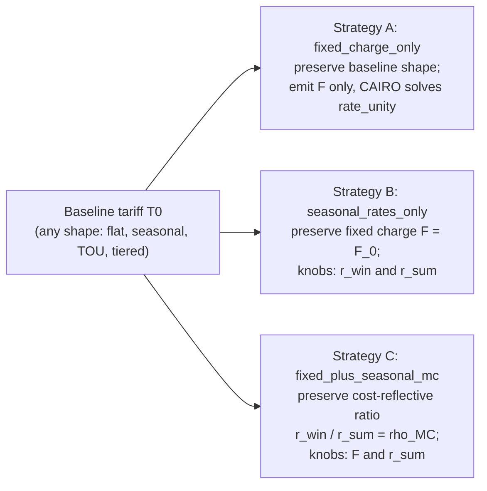

# Fair default rate design: math and closed-form strategies

How to redesign a residential **default tariff** — a single tariff applied to every residential customer — so that it (a) collects the class revenue requirement (C1) and (b) eliminates the cross-subsidy of one identified subclass (e.g. heat-pump customers) measured by the Bill Alignment Test (C2). Three closed-form strategies are presented with implementation names: `fixed_charge_only`, `seasonal_rates_only`, and `fixed_plus_seasonal_mc`. Strategy A (`fixed_charge_only`) preserves the baseline tariff shape and solves only for fixed charge $F^*$ (CAIRO precalc solves `rate_unity`); Strategy B preserves $F_0$ and solves seasonal rates; Strategy C solves fixed charge and seasonal rates while preserving the MC seasonal ratio. Each strategy lands a single tariff in closed form via a $2 \times 2$ Cramer's-rule problem.

This is the math behind issue #398 and the [`utils/mid/compute_fair_default_inputs.py`](utils/mid/compute_fair_default_inputs.py) / [`utils/mid/create_fair_default_tariff.py`](utils/mid/create_fair_default_tariff.py) modules.

## Contents

1. [Why a default tariff (and not a subclass-specific one)](#1-why-a-default-tariff-and-not-a-subclass-specific-one)
2. [Setup and notation](#2-setup-and-notation)
3. [The two design constraints](#3-the-two-design-constraints)
4. [Strategy A: fixed_charge_only (shape-preserving fixed-charge-only)](#4-strategy-a-fixed_charge_only-shape-preserving-fixed-charge-only)
5. [Strategy B: seasonal_rates_only (seasonal rates only, preserve fixed charge)](#5-strategy-b-seasonal_rates_only-seasonal-rates-only-preserve-fixed-charge)
6. [Strategy C: fixed_plus_seasonal_mc (combined with a cost-reflective seasonal ratio)](#6-strategy-c-fixed_plus_seasonal_mc-combined-with-a-cost-reflective-seasonal-ratio)
7. [Geometry of the solution space, and the uniqueness theorem](#7-geometry-of-the-solution-space-and-the-uniqueness-theorem)
8. [Feasibility region](#8-feasibility-region)
9. [Worked example](#9-worked-example)
10. [Limitations and extensions](#10-limitations-and-extensions)
11. [Cross-references](#11-cross-references)

---

## 1. Why a default tariff (and not a subclass-specific one)

The existing seasonal-discount workflow ([`utils/mid/compute_seasonal_discount_inputs.py`](utils/mid/compute_seasonal_discount_inputs.py)) eliminates the heat-pump (HP) cross-subsidy by giving HP customers a _separate_ tariff. It works analytically but is regulatorily awkward: utilities have to identify HP customers in the meter database, defend a separate class in rate cases, and operate dual billing systems.

A **fair default** tariff is one tariff applied to the whole residential class whose structure is chosen so that the target subclass (HP, electric-resistance, EV-only — anything BAT-measurable) nets to zero cross-subsidy automatically. The price of that singularity is a smaller design space — every strategy in §§4–6 picks a small set of scalar knobs to twiddle while leaving the rest of the tariff structure intact:

- **Strategy A (`fixed_charge_only`)** — solve for fixed charge $F$ only; keep baseline volumetric shape unchanged and let CAIRO precalc solve the uniform volumetric scaler (`rate_unity`). (Preserves baseline flat/seasonal/TOU/tiered shape.)
- **Strategy B (`seasonal_rates_only`)** — winter and summer volumetric rates $(r_{\text{win}}, r_{\text{sum}})$, with $F$ held at its baseline value $F_0$. (Two knobs; preserves the fixed charge.)
- **Strategy C (`fixed_plus_seasonal_mc`)** — fixed charge $F$ + summer rate $r_{\text{sum}}$, with the winter rate slaved to $r_{\text{win}} = \rho_{MC} r_{\text{sum}}$ for $\rho_{MC}$ the load-weighted seasonal MC ratio. (Two knobs; preserves the cost-reflective seasonal differential.)

Each strategy is a $2 \times 2$ linear system in its two knobs, solvable in closed form by Cramer's rule. The next section pins down the two constraints they all satisfy.

---

## 2. Setup and notation

All quantities come from CAIRO outputs of a calibrated baseline run (e.g. `run-1` for delivery-only, `run-2` for delivery+supply); see [`context/code/orchestration/run_orchestration.md`](context/code/orchestration/run_orchestration.md).

We use a descriptive subclass subscript: **`cls`** is the whole residential class, **`hp`** is the target subclass (the math generalizes to any subclass; we write `hp` because heat pumps are the v1 use case). Bills are denoted $\text{Bill}$, kWh totals as $\text{kWh}$, etc., so formulas read like English.

| Symbol                                                                      | Meaning                                                          | Unit              | Source artifact                                                                                                                        |
| --------------------------------------------------------------------------- | ---------------------------------------------------------------- | ----------------- | -------------------------------------------------------------------------------------------------------------------------------------- |
| $N_{\text{cls}}, N_{\text{hp}}$                                             | weighted customer counts                                         | customers         | `customer_metadata.csv` (`weight` column × group filter)                                                                               |
| $\text{kWh}_{\text{cls}}, \text{kWh}_{\text{hp}}$                           | weighted annual kWh                                              | kWh/yr            | `scan_resstock_loads`, summed over the year                                                                                            |
| $\text{kWh}^{\text{win}}_{\text{cls}}, \text{kWh}^{\text{win}}_{\text{hp}}$ | weighted **winter** kWh                                          | kWh/yr            | same, restricted to winter months $\mathcal{H}_{\text{win}}$                                                                           |
| $\text{kWh}^{\text{sum}}_{\text{cls}}, \text{kWh}^{\text{sum}}_{\text{hp}}$ | weighted **summer** kWh                                          | kWh/yr            | same, restricted to summer months $\mathcal{H}_{\text{sum}}$                                                                           |
| $\text{Bill}_{\text{cls}}, \text{Bill}_{\text{hp}}$                         | weighted current annual bills under the baseline tariff          | \$/yr             | `bills/elec_bills_year_target.csv`                                                                                                     |
| $X_{\text{hp}}$                                                             | weighted target-subclass cross-subsidy under the baseline tariff | \$/yr             | `cross_subsidization/cross_subsidization_BAT_values.csv`                                                                               |
| $F_0$                                                                       | baseline calibrated fixed charge                                 | \$/customer/month | `_extract_fixed_charge_from_urdb` on `_calibrated.json`                                                                                |
| $\rho_{MC}$                                                                 | load-weighted winter/summer marginal-cost ratio                  | dimensionless     | [`context/methods/tou_and_rates/cost_reflective_tou_rate_design.md`](context/methods/tou_and_rates/cost_reflective_tou_rate_design.md) |

The seasonal split $\mathcal{H}_{\text{win}}, \mathcal{H}_{\text{sum}}$ is the per-utility winter/summer month set defined in the periods YAML ([`utils/pre/season_config.py`](utils/pre/season_config.py)), the same one used by the seasonal-discount workflow. Annual = winter + summer:

$$\text{kWh}_{\text{cls}} = \text{kWh}^{\text{win}}_{\text{cls}} + \text{kWh}^{\text{sum}}_{\text{cls}}, \qquad \text{kWh}_{\text{hp}} = \text{kWh}^{\text{win}}_{\text{hp}} + \text{kWh}^{\text{sum}}_{\text{hp}}.$$

**Sign convention.** $X_{\text{hp}} > 0$ means the target subclass is **overcharged** under the baseline tariff (their bill exceeds their BAT-allocated cost). To eliminate the cross-subsidy, the new tariff must reduce the subclass's total annual bill by exactly $X_{\text{hp}}$ dollars. (Same convention as `compute_subclass_seasonal_discount_inputs`.)

**Two derived targets** appear repeatedly:

- **Class revenue requirement**, $\boxed{RR \equiv \text{Bill}_{\text{cls}}}$. The baseline tariff is calibrated to recover $RR$, so the weighted sum of current bills equals $RR$ by construction.
- **Subclass fair allocated cost**, $\boxed{\text{TC}_{\text{hp}} \equiv \text{Bill}_{\text{hp}} - X_{\text{hp}}}$. By the sign convention this is what the subclass _should_ pay if the residual were allocated by the BAT residual method.

---

## 3. The two design constraints

For any candidate new default tariff $(F, r_{\text{win}}, r_{\text{sum}})$, the **class** and **subclass** annual bills are linear in the parameters:

$$\text{Bill}_{\text{cls}}^{\text{new}} = \underbrace{12 F \cdot N_{\text{cls}}}_{\text{fixed-charge revenue}} + \underbrace{r_{\text{win}} \cdot \text{kWh}^{\text{win}}_{\text{cls}}}_{\text{winter volumetric}} + \underbrace{r_{\text{sum}} \cdot \text{kWh}^{\text{sum}}_{\text{cls}}}_{\text{summer volumetric}}$$

$$\text{Bill}_{\text{hp}}^{\text{new}} = 12 F \cdot N_{\text{hp}} + r_{\text{win}} \cdot \text{kWh}^{\text{win}}_{\text{hp}} + r_{\text{sum}} \cdot \text{kWh}^{\text{sum}}_{\text{hp}}.$$

The two design constraints are:

**(C1) Class revenue sufficiency.** Collect the same total revenue as the calibrated baseline, $\text{Bill}_{\text{cls}}^{\text{new}} = RR$:

$$\boxed{\;12 F \cdot N_{\text{cls}} \;+\; r_{\text{win}} \cdot \text{kWh}^{\text{win}}_{\text{cls}} \;+\; r_{\text{sum}} \cdot \text{kWh}^{\text{sum}}_{\text{cls}} \;=\; RR\;}$$

**(C2) Subclass cross-subsidy elimination.** Charge the subclass exactly its BAT-allocated cost, $\text{Bill}_{\text{hp}}^{\text{new}} = \text{TC}_{\text{hp}}$:

$$\boxed{\;12 F \cdot N_{\text{hp}} \;+\; r_{\text{win}} \cdot \text{kWh}^{\text{win}}_{\text{hp}} \;+\; r_{\text{sum}} \cdot \text{kWh}^{\text{sum}}_{\text{hp}} \;=\; \text{TC}_{\text{hp}}\;}$$

**Both constraints are required.** (C2) on its own — "the subclass pays the right total" — has infinitely many solutions, including ones that fix the subclass's bill by lowering everyone's rates and under-collecting the utility's revenue. (C1) is what forces the redistribution to be **revenue-neutral**: every dollar the subclass no longer pays must come from non-subclass customers, not from the utility. A tariff satisfying (C2) alone is not a viable rate proposal, so the operational definition of "fair default tariff" is the conjunction (C1) ∧ (C2). **Strategies `seasonal_rates_only` and `fixed_plus_seasonal_mc` solve (C1) and (C2) jointly in closed form; `fixed_charge_only` solves $F^*$ and CAIRO precalc then enforces (C1) via uniform volumetric rescaling.**

**Two equations, the right number of knobs.** With two scalar constraints, a viable strategy needs at least two independent design knobs to land a unique solution. Within the seasonal $(F, r_{\text{win}}, r_{\text{sum}})$ design space (used by Strategies B and C), there are three knobs and two equations, leaving a 1-D affine family; each of B and C closes that one degree of freedom with a different "shape-preservation" closure (B holds $F = F_0$; C imposes the cost-reflective seasonal ratio). Strategy A operates in a different 2-D design space — fixed charge and uniform multiplicative scaling of an arbitrary baseline rate book — which is intrinsically two-dimensional, so (C1) ∧ (C2) determine $(F^*_A, \lambda^*_A)$ uniquely with no further closure needed.

---

## 4. Strategy A: fixed_charge_only (shape-preserving fixed-charge-only)

**Premise.** The baseline volumetric rate structure $\mathcal{T}_0$ has any shape — flat, seasonal, TOU, tiered, or anything else — and we want to **preserve that shape**. In implementation we publish only one knob from the inputs module:

- the fixed charge $F$.

CAIRO precalc supplies the uniform volumetric scaling factor implicitly as `rate_unity`, applied to every baseline `rel_value` in the tariff shape. The shape-preservation property is what makes this strategy attractive operationally: if the regulator has already approved a particular seasonal or TOU structure, this strategy keeps that structure and just rescales levels uniformly in precalc.

**Setup.** Denote each customer $i$'s **baseline annual volumetric bill** (the sum of every $\$/\text{kWh}$ × kWh charge they incur under $\mathcal{T}_0$, regardless of structure) as $V^0_i$. At fixed charge $F$ and volumetric scaling $\lambda$, customer $i$'s annual bill is

$$B_i(F, \lambda) = 12 F + \lambda V^0_i.$$

Aggregating with CAIRO weights $w_i$:

$$V^0_{\text{cls}} = \sum_{i \in \text{cls}} w_i V^0_i, \qquad V^0_{\text{hp}} = \sum_{i \in \text{hp}} w_i V^0_i,$$

$$\text{Bill}_{\text{cls}}(F, \lambda) = 12 F N_{\text{cls}} + \lambda V^0_{\text{cls}}, \qquad \text{Bill}_{\text{hp}}(F, \lambda) = 12 F N_{\text{hp}} + \lambda V^0_{\text{hp}}.$$

The baseline corresponds to $(F_0, \lambda_0 = 1)$, which by calibration satisfies $\text{Bill}_{\text{cls}}(F_0, 1) = RR$.

**Linear system.** Imposing (C1) and (C2):

$$\begin{pmatrix} 12 N_{\text{cls}} & V^0_{\text{cls}} \\ 12 N_{\text{hp}} & V^0_{\text{hp}} \end{pmatrix} \begin{pmatrix} F \\ \lambda \end{pmatrix} = \begin{pmatrix} RR \\ \text{TC}_{\text{hp}} \end{pmatrix}.$$

**Determinant.** Define the **per-customer baseline volumetric bill** for each group:

$$\overline{V}^0_{\text{cls}} = \frac{V^0_{\text{cls}}}{N_{\text{cls}}}, \qquad \overline{V}^0_{\text{hp}} = \frac{V^0_{\text{hp}}}{N_{\text{hp}}}.$$

Then

$$\Delta_A \;=\; 12 \cdot \big(N_{\text{cls}} V^0_{\text{hp}} - N_{\text{hp}} V^0_{\text{cls}}\big) \;=\; 12 \cdot N_{\text{cls}} N_{\text{hp}} \cdot \big(\overline{V}^0_{\text{hp}} - \overline{V}^0_{\text{cls}}\big).$$

Since $N_{\text{cls}}, N_{\text{hp}} > 0$, the sign of $\Delta_A$ is the sign of $(\overline{V}^0_{\text{hp}} - \overline{V}^0_{\text{cls}})$ — i.e. whether the subclass per-customer baseline volumetric bill exceeds the class average.

**Closed form (absolute).** By Cramer's rule:

$$F^*_A = \frac{RR \cdot V^0_{\text{hp}} - \text{TC}_{\text{hp}} \cdot V^0_{\text{cls}}}{\Delta_A}.$$

The corresponding scale factor is then implicit in C1:

$$\lambda(F^*_A) = \frac{RR - 12 F^*_A N_{\text{cls}}}{V^0_{\text{cls}}}.$$

**Closed form (delta from baseline).** Substituting $RR = 12 F_0 N_{\text{cls}} + V^0_{\text{cls}}$ and $\text{TC}_{\text{hp}} = 12 F_0 N_{\text{hp}} + V^0_{\text{hp}} - X_{\text{hp}}$ and simplifying — same algebra trick as the seasonal case, the baseline terms cancel cleanly:

$$\boxed{\;\Delta F_A \;=\; F^*_A - F_0 \;=\; \frac{X_{\text{hp}} \cdot \overline{V}^0_{\text{cls}}}{12 \cdot N_{\text{hp}} \cdot (\overline{V}^0_{\text{hp}} - \overline{V}^0_{\text{cls}})}, \qquad \Delta \lambda_A \;=\; \lambda^*_A - 1 \;=\; \frac{-X_{\text{hp}}}{N_{\text{hp}} \cdot (\overline{V}^0_{\text{hp}} - \overline{V}^0_{\text{cls}})}.\;}$$

Both formulas share the denominator $N_{\text{hp}} (\overline{V}^0_{\text{hp}} - \overline{V}^0_{\text{cls}})$, so the size of the fixed-charge raise and the size of the volumetric-scaling cut are tied together by a factor of $\overline{V}^0_{\text{cls}} / 12$.

**Number of solutions.**

| Condition                                                                            | # solutions                                                                                                                                                  |
| ------------------------------------------------------------------------------------ | ------------------------------------------------------------------------------------------------------------------------------------------------------------ |
| $\overline{V}^0_{\text{hp}} \ne \overline{V}^0_{\text{cls}}$ (i.e. $\Delta_A \ne 0$) | **Exactly one** $(F^*_A, \lambda^*_A)$.                                                                                                                      |
| $\overline{V}^0_{\text{hp}} = \overline{V}^0_{\text{cls}}$ AND $X_{\text{hp}} = 0$   | **Infinitely many** — the constraints collapse to one equation; any $(F, \lambda)$ on the class-RR line works.                                               |
| $\overline{V}^0_{\text{hp}} = \overline{V}^0_{\text{cls}}$ AND $X_{\text{hp}} \ne 0$ | **Zero** — constraints are parallel-but-inconsistent. With identical per-customer baseline volumetric bills, no $(F, \lambda)$ tweak can shift the subclass. |

In practice, electrification of heating shifts therms onto the kWh meter, so $\overline{V}^0_{\text{hp}} > \overline{V}^0_{\text{cls}}$ comfortably and the answer is always exactly one.

**Sign intuition (subclass overcharged, subclass per-customer volumetric bill larger than class average).** With $X_{\text{hp}} > 0$ and $\overline{V}^0_{\text{hp}} > \overline{V}^0_{\text{cls}}$:

- $\Delta F_A > 0$ — **raise** the fixed charge,
- $\Delta \lambda_A < 0$ — **scale down** every volumetric rate.

A fixed-charge raise costs every class customer the same dollars, so non-subclass customers (who outnumber HP roughly 9-to-1 in NY/RI) absorb most of the new fixed-charge revenue. A volumetric scale-down benefits subclass customers more in absolute dollars because they consume more kWh and therefore their baseline volumetric bill is bigger. Net flow: dollars from non-subclass to subclass, class RR preserved.

**Failure modes.**

- **Negative scaled rate.** $\lambda^*_A < 0$ means at least one volumetric rate goes negative — un-publishable. Almost never happens unless $X_{\text{hp}}$ is implausibly large relative to total volumetric revenue.
- **Fixed charge out of bounds.** If $F^*_A$ falls below a regulatory floor (e.g. \$5/month) or above a customer-acceptance ceiling (rate cases often cap fixed-charge increases at, say, doubling), report the clipped tariff and the residual cross-subsidy.

### Implementation note

`compute_fair_default_inputs.py` emits only `fixed_charge_only_fixed_charge` for Strategy A. `create_fair_default_tariff.py` copies the baseline tariff shape verbatim and overwrites only `fixedchargefirstmeter`; CAIRO precalc then computes the implied `rate_unity` uniformly across the baseline volumetric structure.

---

## 5. Strategy B: seasonal_rates_only (seasonal rates only, preserve fixed charge)

**Closure:** hold $F = F_0$, the calibrated baseline value. The two unknowns are now $(r_{\text{win}}, r_{\text{sum}})$:

$$\begin{pmatrix} \text{kWh}^{\text{win}}_{\text{cls}} & \text{kWh}^{\text{sum}}_{\text{cls}} \\ \text{kWh}^{\text{win}}_{\text{hp}} & \text{kWh}^{\text{sum}}_{\text{hp}} \end{pmatrix} \begin{pmatrix} r_{\text{win}} \\ r_{\text{sum}} \end{pmatrix} = \begin{pmatrix} RR - 12 F_0 N_{\text{cls}} \\ \text{TC}_{\text{hp}} - 12 F_0 N_{\text{hp}} \end{pmatrix}.$$

**Determinant.** Let the **winter share** of each group be

$$\sigma_{\text{cls}} \;=\; \frac{\text{kWh}^{\text{win}}_{\text{cls}}}{\text{kWh}_{\text{cls}}}, \qquad \sigma_{\text{hp}} \;=\; \frac{\text{kWh}^{\text{win}}_{\text{hp}}}{\text{kWh}_{\text{hp}}}.$$

Substituting $\text{kWh}^{\text{win}}_{\text{cls}} = \sigma_{\text{cls}} \text{kWh}_{\text{cls}}$, $\text{kWh}^{\text{sum}}_{\text{cls}} = (1 - \sigma_{\text{cls}}) \text{kWh}_{\text{cls}}$, and analogously for `hp`, the determinant factors cleanly:

$$\boxed{\;D \;\equiv\; \text{kWh}^{\text{win}}_{\text{cls}} \cdot \text{kWh}^{\text{sum}}_{\text{hp}} - \text{kWh}^{\text{win}}_{\text{hp}} \cdot \text{kWh}^{\text{sum}}_{\text{cls}} \;=\; \text{kWh}_{\text{cls}} \cdot \text{kWh}_{\text{hp}} \cdot \big(\sigma_{\text{cls}} - \sigma_{\text{hp}}\big)\;}$$

Since $\text{kWh}_{\text{cls}}, \text{kWh}_{\text{hp}} > 0$, the **sign of $D$** is the sign of $(\sigma_{\text{cls}} - \sigma_{\text{hp}})$:

| Condition on winter shares                                            | Sign of $D$ | When this happens                                                                                                          |
| --------------------------------------------------------------------- | ----------- | -------------------------------------------------------------------------------------------------------------------------- |
| $\sigma_{\text{hp}} = \sigma_{\text{cls}}$                            | $D = 0$     | Degenerate. Never with real heat pumps.                                                                                    |
| $\sigma_{\text{hp}} > \sigma_{\text{cls}}$ — target more winter-heavy | $D < 0$     | **The realistic HP case.** $\sigma_{\text{hp}} \approx 0.65{-}0.75$ vs $\sigma_{\text{cls}} \approx 0.55{-}0.60$ in NY/RI. |
| $\sigma_{\text{hp}} < \sigma_{\text{cls}}$ — target less winter-heavy | $D > 0$     | Solar/EV-only or summer-AC-heavy subclasses.                                                                               |

**Closed-form solution (absolute).** By Cramer's rule:

$$r^*_{\text{win},B} = \frac{(RR - 12 F_0 N_{\text{cls}}) \cdot \text{kWh}^{\text{sum}}_{\text{hp}} - (\text{TC}_{\text{hp}} - 12 F_0 N_{\text{hp}}) \cdot \text{kWh}^{\text{sum}}_{\text{cls}}}{D},$$

$$r^*_{\text{sum},B} = \frac{(\text{TC}_{\text{hp}} - 12 F_0 N_{\text{hp}}) \cdot \text{kWh}^{\text{win}}_{\text{cls}} - (RR - 12 F_0 N_{\text{cls}}) \cdot \text{kWh}^{\text{win}}_{\text{hp}}}{D}.$$

**Closed-form solution (delta from baseline equivalent flat $r_0$).** Substituting $RR$ and $\text{TC}_{\text{hp}}$ as before and simplifying:

$$\boxed{\;\Delta r_{\text{win},B} \;=\; \frac{X_{\text{hp}} \cdot \text{kWh}^{\text{sum}}_{\text{cls}}}{D}, \qquad \Delta r_{\text{sum},B} \;=\; \frac{-X_{\text{hp}} \cdot \text{kWh}^{\text{win}}_{\text{cls}}}{D}.\;}$$

(For a baseline that is already seasonal, replace $r_0$ with $r_{\text{win},0}, r_{\text{sum},0}$ on the left-hand side; the deltas on the right are unchanged because (C1) and (C2) are linear.)

**Number of solutions.**

| Condition                                                            | # solutions                                                                                                                                                        |
| -------------------------------------------------------------------- | ------------------------------------------------------------------------------------------------------------------------------------------------------------------ |
| $\sigma_{\text{hp}} \ne \sigma_{\text{cls}}$ (i.e. $D \ne 0$)        | **Exactly one** $(r^*_{\text{win},B}, r^*_{\text{sum},B})$.                                                                                                        |
| $\sigma_{\text{hp}} = \sigma_{\text{cls}}$ AND $X_{\text{hp}} = 0$   | **Infinitely many.**                                                                                                                                               |
| $\sigma_{\text{hp}} = \sigma_{\text{cls}}$ AND $X_{\text{hp}} \ne 0$ | **Zero.** No seasonal rate pair can fix the cross-subsidy: target and class respond identically to seasonal price changes, so winter-vs-summer is the wrong lever. |

**Sign intuition (HP case, $D < 0$, $X_{\text{hp}} > 0$).**

- $\Delta r_{\text{win},B} = X_{\text{hp}} \text{kWh}^{\text{sum}}_{\text{cls}} / D < 0$ — **cut** the winter rate.
- $\Delta r_{\text{sum},B} = -X_{\text{hp}} \text{kWh}^{\text{win}}_{\text{cls}} / D > 0$ — **raise** the summer rate.

The baseline tariff is over-collecting from HP because winter kWh are priced too dearly relative to HP's high winter consumption. Lowering $r_{\text{win}}$ helps HP relatively more (HP has higher winter share); raising $r_{\text{sum}}$ recovers the lost revenue mostly from non-HP (non-HP has higher summer share). Net effect: dollars flow from non-HP to HP.

**Failure mode.** Negative seasonal rates. The closed form does not enforce $r_{\text{win}}, r_{\text{sum}} \ge 0$. If e.g. $r^*_{\text{win},B} < 0$, options:

1. **Clip to zero** and recompute the other rate from (C1) alone, then report the residual cross-subsidy the clipped tariff leaves uncorrected.
2. **Fall back to Strategy A or C** — different denominators, so one strategy may be feasible when another is not.

---

## 6. Strategy C: fixed_plus_seasonal_mc (combined with a cost-reflective seasonal ratio)

**Closure:** use all three knobs $(F, r_{\text{win}}, r_{\text{sum}})$, and pin the seasonal differential to the **cost-reflective** ratio:

$$\frac{r_{\text{win}}}{r_{\text{sum}}} \;=\; \rho_{MC}, \qquad \rho_{MC} \;=\; \frac{\overline{MC}_{\text{win}}}{\overline{MC}_{\text{sum}}} \;=\; \frac{\sum_{h \in \mathcal{H}_{\text{win}}} MC_h L_h \,\big/\, \sum_{h \in \mathcal{H}_{\text{win}}} L_h}{\sum_{h \in \mathcal{H}_{\text{sum}}} MC_h L_h \,\big/\, \sum_{h \in \mathcal{H}_{\text{sum}}} L_h}.$$

The numerator and denominator are demand-weighted seasonal MC averages, computed exactly as in [`context/methods/tou_and_rates/cost_reflective_tou_rate_design.md`](context/methods/tou_and_rates/cost_reflective_tou_rate_design.md).

**Reduction to a $2 \times 2$ system.** Substituting $r_{\text{win}} = \rho_{MC} r_{\text{sum}}$ into (C1) and (C2), define the **MC-weighted kWh** for each group — the annual kWh figure each group would produce if winter kWh were "weighted up" by the MC ratio:

$$\widetilde{\text{kWh}}_{\text{cls}} \;\equiv\; \rho_{MC} \cdot \text{kWh}^{\text{win}}_{\text{cls}} + \text{kWh}^{\text{sum}}_{\text{cls}}, \qquad \widetilde{\text{kWh}}_{\text{hp}} \;\equiv\; \rho_{MC} \cdot \text{kWh}^{\text{win}}_{\text{hp}} + \text{kWh}^{\text{sum}}_{\text{hp}}.$$

Then (C1) and (C2) become

$$\begin{pmatrix} 12 N_{\text{cls}} & \widetilde{\text{kWh}}_{\text{cls}} \\ 12 N_{\text{hp}} & \widetilde{\text{kWh}}_{\text{hp}} \end{pmatrix} \begin{pmatrix} F \\ r_{\text{sum}} \end{pmatrix} = \begin{pmatrix} RR \\ \text{TC}_{\text{hp}} \end{pmatrix}.$$

This is the same matrix shape as Strategy A's flat-baseline special case, with MC-weighted kWh playing the role of plain kWh. Determinant and Cramer's-rule solution:

$$\Delta_C \;=\; 12 \cdot N_{\text{cls}} \cdot N_{\text{hp}} \cdot \big(\overline{\widetilde{\text{kWh}}}_{\text{hp}} - \overline{\widetilde{\text{kWh}}}_{\text{cls}}\big),$$

$$F^*_C = \frac{RR \cdot \widetilde{\text{kWh}}_{\text{hp}} - \text{TC}_{\text{hp}} \cdot \widetilde{\text{kWh}}_{\text{cls}}}{\Delta_C}, \qquad r^*_{\text{sum},C} = \frac{12 \cdot (\text{TC}_{\text{hp}} \cdot N_{\text{cls}} - RR \cdot N_{\text{hp}})}{\Delta_C}, \qquad r^*_{\text{win},C} = \rho_{MC} \cdot r^*_{\text{sum},C}.$$

**Number of solutions.**

| Condition                                                                                                                  | # solutions                                                                                     |
| -------------------------------------------------------------------------------------------------------------------------- | ----------------------------------------------------------------------------------------------- |
| $\overline{\widetilde{\text{kWh}}}_{\text{hp}} \ne \overline{\widetilde{\text{kWh}}}_{\text{cls}}$ (i.e. $\Delta_C \ne 0$) | **Exactly one** $(F^*_C, r^*_{\text{sum},C})$, hence one $(F, r_{\text{win}}, r_{\text{sum}})$. |
| $\overline{\widetilde{\text{kWh}}}_{\text{hp}} = \overline{\widetilde{\text{kWh}}}_{\text{cls}}$ AND $X_{\text{hp}} = 0$   | **Infinitely many.**                                                                            |
| $\overline{\widetilde{\text{kWh}}}_{\text{hp}} = \overline{\widetilde{\text{kWh}}}_{\text{cls}}$ AND $X_{\text{hp}} \ne 0$ | **Zero.**                                                                                       |

The non-degeneracy condition is a positive linear combination of "subclass uses more winter kWh per customer" and "subclass uses more summer kWh per customer" — both true in the realistic HP case — so $\Delta_C \ne 0$ in practice.

**Why this is the preferred closure.** Among the (C1) ∧ (C2)-feasible tariffs in $(F, r_{\text{win}}, r_{\text{sum}})$-space (see §7), Strategy C is the one whose seasonal differential matches the cost-causation differential. It simultaneously (i) collects $RR$, (ii) zeros the subclass cross-subsidy, and (iii) sends the seasonal price signal an ideal cost-reflective two-period tariff would send.

---

## 7. Geometry of the solution space, and the uniqueness theorem

The user's question — _"For any given fixed charge, are there zero, one, or infinitely many seasonal rate pairs that satisfy the two constraints?"_ — has a clean answer directly from §3's dimension count.

**Dimension counting** (taking the seasonal $(F, r_{\text{win}}, r_{\text{sum}})$ design space as the running example):

| Setup                                                                                | Unknowns                                | Independent equations | Geometry of the solution set                                     |
| ------------------------------------------------------------------------------------ | --------------------------------------- | --------------------- | ---------------------------------------------------------------- |
| (C2) alone                                                                           | 3 ($F, r_{\text{win}}, r_{\text{sum}}$) | 1                     | 2-D plane in 3-space — **infinitely many** solutions             |
| (C1) + (C2), all three knobs free                                                    | 3                                       | 2                     | **1-D line** in 3-space — infinitely many along the line         |
| (C1) + (C2), pin one of the three (`seasonal_rates_only` / `fixed_plus_seasonal_mc`) | 2                                       | 2                     | **single point** — exactly one solution (generically)            |
| (C1) + (C2), Strategy A (`fixed_charge_only`) $(F, \lambda)$ design space            | 2                                       | 2                     | **single point** in 2-space — exactly one solution (generically) |

Strategy A (`fixed_charge_only`) lives in a different design space — $(F, \lambda)$ on top of an arbitrary baseline shape — so it doesn't fit on the same 3-space picture. But its uniqueness story is identical: 2 knobs and 2 equations land a single point.

**Theorem (uniqueness for fixed $F$).** Fix any value of $F$. Then (C1) and (C2) restricted to the unknowns $(r_{\text{win}}, r_{\text{sum}})$ form a $2 \times 2$ linear system

$$\begin{pmatrix} \text{kWh}^{\text{win}}_{\text{cls}} & \text{kWh}^{\text{sum}}_{\text{cls}} \\ \text{kWh}^{\text{win}}_{\text{hp}} & \text{kWh}^{\text{sum}}_{\text{hp}} \end{pmatrix} \begin{pmatrix} r_{\text{win}} \\ r_{\text{sum}} \end{pmatrix} = \begin{pmatrix} RR - 12 F N_{\text{cls}} \\ \text{TC}_{\text{hp}} - 12 F N_{\text{hp}} \end{pmatrix}$$

with determinant $D = \text{kWh}_{\text{cls}} \text{kWh}_{\text{hp}} (\sigma_{\text{cls}} - \sigma_{\text{hp}})$ (from §5). The number of seasonal-rate pairs $(r_{\text{win}}, r_{\text{sum}})$ that satisfy both (C1) and (C2) at this $F$ is:

| Case                         | Condition                                                | # solutions                                                                             |
| ---------------------------- | -------------------------------------------------------- | --------------------------------------------------------------------------------------- |
| **Generic**                  | $D \ne 0$ ($\sigma_{\text{hp}} \ne \sigma_{\text{cls}}$) | **Exactly one** — given by Cramer's rule.                                               |
| **Degenerate, consistent**   | $D = 0$ AND $X_{\text{hp}} = 0$                          | **Infinitely many** — any $(r_{\text{win}}, r_{\text{sum}})$ on a line in 2-D.          |
| **Degenerate, inconsistent** | $D = 0$ AND $X_{\text{hp}} \ne 0$                        | **Zero** — parallel-but-offset constraints. (Need to change $F$ to recover a solution.) |

**In the heat-pump case the answer is always exactly one,** because heat-pump electrification of heating makes $\sigma_{\text{hp}}$ meaningfully larger than $\sigma_{\text{cls}}$ ($\sigma_{\text{hp}} \approx 0.65{-}0.75$ vs $\sigma_{\text{cls}} \approx 0.55{-}0.60$ in NY/RI), so $D < 0 \ne 0$.

**Geometric picture: three different shape-preservation premises.** Strategies `fixed_charge_only`, `seasonal_rates_only`, and `fixed_plus_seasonal_mc` each project the (C1) ∧ (C2) problem onto a different 2-knob design space, chosen to preserve a different aspect of the baseline tariff. Each strategy is **its own** $2 \times 2$ Cramer's-rule problem, not a different point on a shared line:

Other reasonable closures — fix $F$ at the regulator's preferred value, fix the winter rate at the marginal energy cost, enforce a fuel-cost floor on $r_{\text{sum}}$ — give still other 2-knob systems with the same Cramer's-rule shape and a closed-form answer.

**The "fixed-$F$" theorem above** describes the inner structure of Strategy B (`seasonal_rates_only`) and any other strategy that holds $F$ fixed: once $F$ is pinned, the seasonal rates are uniquely determined in the generic case. It is the cleanest answer to the user's framing question — _"for a given fixed charge, how many seasonal rate pairs satisfy both constraints?"_ — and it is what tells us Strategy B always lands in a single point rather than a line.

**Practical consequence.** None of the strategies need a numerical optimizer or a search. The hard problem is choosing the right shape-preservation premise (`fixed_charge_only` vs `seasonal_rates_only` vs `fixed_plus_seasonal_mc`, or a hybrid), not solving the equations once that choice is made.

---

## 8. Feasibility region

The closed-form solutions are real numbers; they still have to be physically meaningful tariffs. Each strategy faces its own feasibility test:

| Strategy | Hard constraints                                                                                                            | Soft (regulatory) constraints                              |
| -------- | --------------------------------------------------------------------------------------------------------------------------- | ---------------------------------------------------------- |
| A        | $\lambda^*_A > 0$ (so every scaled volumetric rate stays $> 0$); $F^*_A \ge 0$                                              | $F^*_A \in [F^{\text{reg}}_{\min}, F^{\text{reg}}_{\max}]$ |
| B        | $r^*_{\text{win}, B} \ge 0$, $r^*_{\text{sum}, B} \ge 0$                                                                    | (none — $F$ is held at $F_0$, which is already legal)      |
| C        | $r^*_{\text{sum}, C} \ge 0$ (then $r^*_{\text{win}, C} = \rho_{MC} r^*_{\text{sum}, C} \ge 0$ automatically); $F^*_C \ge 0$ | $F^*_C \in [F^{\text{reg}}_{\min}, F^{\text{reg}}_{\max}]$ |

In the realistic HP case (small $X_{\text{hp}}$ relative to total volumetric revenue, $\overline{V}^0_{\text{hp}} > \overline{V}^0_{\text{cls}}$), all three strategies clear the hard constraints comfortably; the binding constraint is usually the regulatory window on the fixed charge.

**Bonus 1-D family for Strategy B.** Because Strategy B holds $F$ fixed, there is a natural sensitivity sweep: re-solve (C1) ∧ (C2) with $F$ varying over $[F^{\text{reg}}_{\min}, F^{\text{reg}}_{\max}]$. By the fixed-$F$ theorem in §7 this yields a unique $(r_{\text{win}}(F), r_{\text{sum}}(F))$ for each $F$, tracing an affine line in 3-space. Intersect the three half-lines $r_{\text{win}} \ge 0$, $r_{\text{sum}} \ge 0$, $F \ge F^{\text{reg}}_{\min}$ to get the feasible $F$-interval; [`utils/mid/compute_fair_default_inputs.py`](utils/mid/compute_fair_default_inputs.py) reports this interval explicitly so downstream sensitivity analysis can plot the feasible family of seasonal-rate solutions.

If a strategy's closed-form solution falls outside its feasible region, the implementation reports the clipped tariff together with the residual cross-subsidy that remains.

---

## 9. Worked example

Stylized numbers chosen to make the arithmetic transparent. For a residential class with $N_{\text{cls}} = 400{,}000$ customers:

- **Class:** $\text{kWh}_{\text{cls}} = 4 \cdot 10^9$, $\text{kWh}^{\text{win}}_{\text{cls}} = 2.4 \cdot 10^9$ (winter share $\sigma_{\text{cls}} = 60\%$), $\text{kWh}^{\text{sum}}_{\text{cls}} = 1.6 \cdot 10^9$. Per-customer: $\overline{\text{kWh}}_{\text{cls}} = 10{,}000$ kWh/yr.
- **HP subclass:** $N_{\text{hp}} = 40{,}000$ (10% of class), $\text{kWh}_{\text{hp}} = 6 \cdot 10^8$ (15% of class kWh), $\text{kWh}^{\text{win}}_{\text{hp}} = 4.5 \cdot 10^8$ (winter share $\sigma_{\text{hp}} = 75\%$), $\text{kWh}^{\text{sum}}_{\text{hp}} = 1.5 \cdot 10^8$. Per-customer: $\overline{\text{kWh}}_{\text{hp}} = 15{,}000$ kWh/yr (50% above class average).
- **Calibrated baseline:** $F_0 = \$15$/month, equivalent flat $r_0 = \$0.16$/kWh.
  - $RR = 12 \cdot 15 \cdot 400{,}000 + 0.16 \cdot 4 \cdot 10^9 = \$712\text{M}/\text{yr}$.
  - $\text{Bill}_{\text{hp}} = 12 \cdot 15 \cdot 40{,}000 + 0.16 \cdot 6 \cdot 10^8 = \$103.2\text{M}/\text{yr}$. Per-customer HP bill: $\$2{,}580$/yr.
- **HP cross-subsidy from BAT:** $X_{\text{hp}} = +\$5\text{M}/\text{yr}$ ⇒ $\text{TC}_{\text{hp}} = \$98.2\text{M}/\text{yr}$. Per-customer HP target bill: $\$2{,}455$/yr (a $\$125$/yr reduction).

**Strategy A (`fixed_charge_only`).** The baseline is flat ($r_0 = \$0.16$/kWh), so the implied CAIRO `rate_unity` scales to a flat post-precalc volumetric rate in this stylized example.

$$\Delta_A = 12 \cdot N_{\text{cls}} \cdot N_{\text{hp}} \cdot (\overline{\text{kWh}}_{\text{hp}} - \overline{\text{kWh}}_{\text{cls}}) = 12 \cdot 4 \cdot 10^5 \cdot 4 \cdot 10^4 \cdot 5 \cdot 10^3 = 9.6 \cdot 10^{14}.$$

$$\Delta F_A = \frac{X_{\text{hp}} \cdot \overline{\text{kWh}}_{\text{cls}}}{12 N_{\text{hp}} \cdot (\overline{\text{kWh}}_{\text{hp}} - \overline{\text{kWh}}_{\text{cls}})} = \frac{5 \cdot 10^6 \cdot 10^4}{12 \cdot 4 \cdot 10^4 \cdot 5 \cdot 10^3} \approx +\$20.83/\text{month}, \qquad F^*_A \approx \$35.83/\text{month}.$$

$$\Delta \lambda_A = \frac{-X_{\text{hp}}}{N_{\text{hp}} (\overline{\text{kWh}}_{\text{hp}} - \overline{\text{kWh}}_{\text{cls}})} = \frac{-5 \cdot 10^6}{4 \cdot 10^4 \cdot 5 \cdot 10^3} = -0.15625, \qquad \lambda^*_A = 0.84375.$$

The new (still flat) volumetric rate is $r^*_A = \lambda^*_A \cdot r_0 = 0.84375 \cdot 0.16 = \$0.135/\text{kWh}$, equivalently obtained from (C1) directly: $(712 \cdot 10^6 - 12 \cdot 35.83 \cdot 4 \cdot 10^5) / (4 \cdot 10^9) = 0.135$.

Per-customer HP check: $12 \cdot 35.83 + 15{,}000 \cdot 0.135 = 430 + 2{,}025 = \$2{,}455$ ✓.

**Strategy B** (preserve $F_0 = \$15$/month).

$$D = \text{kWh}_{\text{cls}} \cdot \text{kWh}_{\text{hp}} \cdot (\sigma_{\text{cls}} - \sigma_{\text{hp}}) = 4 \cdot 10^9 \cdot 6 \cdot 10^8 \cdot (-0.15) = -3.6 \cdot 10^{17}.$$

$$\Delta r_{\text{win},B} = \frac{X_{\text{hp}} \cdot \text{kWh}^{\text{sum}}_{\text{cls}}}{D} = \frac{5 \cdot 10^6 \cdot 1.6 \cdot 10^9}{-3.6 \cdot 10^{17}} \approx -\$0.0222/\text{kWh}, \qquad \Delta r_{\text{sum},B} = \frac{-X_{\text{hp}} \cdot \text{kWh}^{\text{win}}_{\text{cls}}}{D} \approx +\$0.0333/\text{kWh}.$$

Adding the deltas to the baseline equivalent flat rate $r_0 = 0.16$:

$$r^{*}_{\text{win},B} \approx \$0.138/\text{kWh}, \qquad r^{*}_{\text{sum},B} \approx \$0.193/\text{kWh}.$$

Per-customer HP check: with $\overline{\text{kWh}^{\text{win}}}_{\text{hp}} = 11{,}250$ and $\overline{\text{kWh}^{\text{sum}}}_{\text{hp}} = 3{,}750$ (per HP customer), the HP bill is

$$12 \cdot 15 + 0.138 \cdot 11{,}250 + 0.193 \cdot 3{,}750 \approx 180 + 1{,}553 + 724 \approx \$2{,}456 \;\;\checkmark \;(\text{within rounding}).$$

**Strategy C** with stylized $\rho_{MC} = 1.4$ (winter MC 40% above summer).

$$\widetilde{\text{kWh}}_{\text{cls}} = 1.4 \cdot 2.4 \cdot 10^9 + 1.6 \cdot 10^9 = 4.96 \cdot 10^9, \qquad \widetilde{\text{kWh}}_{\text{hp}} = 1.4 \cdot 4.5 \cdot 10^8 + 1.5 \cdot 10^8 = 7.8 \cdot 10^8.$$

Per-customer: $\overline{\widetilde{\text{kWh}}}_{\text{cls}} = 12{,}400$, $\overline{\widetilde{\text{kWh}}}_{\text{hp}} = 19{,}500$.

$$\Delta_C = 12 \cdot N_{\text{cls}} \cdot N_{\text{hp}} \cdot (\overline{\widetilde{\text{kWh}}}_{\text{hp}} - \overline{\widetilde{\text{kWh}}}_{\text{cls}}) = 12 \cdot 4 \cdot 10^5 \cdot 4 \cdot 10^4 \cdot 7{,}100 \approx 1.363 \cdot 10^{15}.$$

$$F^*_C = \frac{RR \cdot \widetilde{\text{kWh}}_{\text{hp}} - \text{TC}_{\text{hp}} \cdot \widetilde{\text{kWh}}_{\text{cls}}}{\Delta_C} = \frac{712 \cdot 10^6 \cdot 7.8 \cdot 10^8 - 98.2 \cdot 10^6 \cdot 4.96 \cdot 10^9}{1.363 \cdot 10^{15}} \approx +\$50.10/\text{month}.$$

Solve (C2) for $r^*_{\text{sum},C}$ with $r_{\text{win}} = 1.4 r_{\text{sum}}$: $r^*_{\text{sum},C} = (\text{TC}_{\text{hp}} - 12 F^*_C N_{\text{hp}}) / \widetilde{\text{kWh}}_{\text{hp}} \approx \$0.0951/\text{kWh}$, then $r^*_{\text{win},C} = 1.4 \cdot r^*_{\text{sum},C} \approx \$0.1331/\text{kWh}$. Per-customer HP check: $12 \cdot 50.10 + 11{,}250 \cdot 0.1331 + 3{,}750 \cdot 0.0951 \approx 601 + 1{,}497 + 357 = \$2{,}455$ ✓.

**Three tariffs side-by-side.**

| Strategy                                                          | $F^*$ (\$/mo) | $r^*_{\text{win}}$ (\$/kWh) | $r^*_{\text{sum}}$ (\$/kWh) | Cost-reflective ratio?                                     |
| ----------------------------------------------------------------- | ------------- | --------------------------- | --------------------------- | ---------------------------------------------------------- |
| Baseline                                                          | 15.00         | 0.160                       | 0.160                       | 1.00 (flat)                                                |
| A (`fixed_charge_only`) — shape-preserving via CAIRO `rate_unity` | 35.83         | 0.135                       | 0.135                       | 1.00 (flat — inherited from baseline shape)                |
| B (`seasonal_rates_only`) — seasonal only ($F$ held at $F_0$)     | 15.00         | 0.138                       | 0.193                       | 0.71 (winter cheaper than summer — _anti-cost-reflective_) |
| C (`fixed_plus_seasonal_mc`) — cost-reflective ratio enforced     | 50.10         | 0.133                       | 0.095                       | 1.40 (winter / summer = $\rho_{MC}$)                       |

Note `seasonal_rates_only`'s anti-cost-reflective signal: with this stylized setup it lowers the winter price to give HP a break, even though winter MC is higher than summer. `fixed_plus_seasonal_mc` resolves that tension by using the fixed charge as a third lever, freeing the seasonal rates to track $\rho_{MC}$ exactly.

---

## 10. Limitations and extensions

- **Single subclass.** The framework eliminates one cross-subsidy (e.g. HP). Multi-subclass elimination — say, HP and electric-resistance and EV-only all zeroed simultaneously — adds constraints faster than the $(F, r_{\text{win}}, r_{\text{sum}})$ design space adds knobs, and requires either TOU/tiered structure or simultaneous adjustments to multiple class-wide parameters. Left to a follow-up issue.
- **2-period seasonal in B and C.** Strategy A (`fixed_charge_only`) is shape-agnostic — it works on any baseline shape because CAIRO precalc applies a uniform `rate_unity` multiplier to the baseline volumetric shape — but `seasonal_rates_only` and `fixed_plus_seasonal_mc` are written for a 2-period seasonal output tariff. A natural "Strategy D" would carry $(F, r_{\text{win,peak}}, r_{\text{win,off}}, r_{\text{sum,peak}}, r_{\text{sum,off}})$ and close the now-larger system by enforcing both the seasonal MC ratio $\rho_{MC}$ and the within-season peak ratios from [`context/methods/tou_and_rates/cost_reflective_tou_rate_design.md`](context/methods/tou_and_rates/cost_reflective_tou_rate_design.md).
- **Delivery vs supply.** Run-1 outputs cover delivery; run-2 covers delivery + supply. The strategies above can be applied to either, producing `_default_fair_<strategy>.json` and `_default_fair_<strategy>_supply.json` tariffs respectively. The supply variant uses the same math with supply-only $X_{\text{hp}}$ and supply-only baseline bills.
- **Interaction with the LMI discount.** Apply the LMI tier credit _after_ the fair-default tariff is constructed (the LMI credit is a flat per-tier dollar discount). The fair-default math is unchanged; the LMI credit reduces realized revenue but is funded outside the class RR, consistent with the existing [`utils/post/apply_ny_lmi_to_master_bills.py`](utils/post/apply_ny_lmi_to_master_bills.py) workflow.
- **C1/C2 split in implementation.** `compute_fair_default_inputs.py` solves joint C1+C2 directly for `seasonal_rates_only` and `fixed_plus_seasonal_mc`. For `fixed_charge_only`, it emits only $F^*_A$; CAIRO precalc enforces C1 by solving `rate_unity` on the preserved baseline shape, and C2 holds at that $F^*_A$.
- **Calibration drift.** The closed forms assume CAIRO's calibrated bills exactly recover $RR$ and the BAT residual exactly equals $\text{TC}_{\text{hp}}$. CAIRO's iterative calibration leaves small (sub-percent) residuals; `seasonal_rates_only` and `fixed_plus_seasonal_mc` are published as absolute rates and then nudged by precalc, while `fixed_charge_only` already relies on that precalc pass for volumetric scaling.

---

## 11. Cross-references

**Implementation:**

- [`utils/mid/compute_fair_default_inputs.py`](utils/mid/compute_fair_default_inputs.py) — emits the inputs CSV with $N_{\text{cls}}, N_{\text{hp}}, V^0_{\text{cls/hp}}, \text{kWh}^{\text{win/sum}}_{\text{cls/hp}}, RR, \text{Bill}_{\text{hp}}, X_{\text{hp}}, \rho_{MC}$ and the strategy outputs under the new prefixes: `fixed_charge_only_*` (emits $F^*_A$, no published $\lambda$), `seasonal_rates_only_*` (joint C1+C2 at $F = F_0$), and `fixed_plus_seasonal_mc_*` (joint C1+C2 with $r_{\text{win}} / r_{\text{sum}} = \rho_{MC}$); plus the Strategy-B feasible $F$-interval $[F_{\min}, F_{\max}]$.
- [`utils/mid/create_fair_default_tariff.py`](utils/mid/create_fair_default_tariff.py) — applies the chosen strategy to the baseline URDB tariff: `fixed_charge_only` copies `energyratestructure` and schedules verbatim and overwrites only `fixedchargefirstmeter`; `seasonal_rates_only` and `fixed_plus_seasonal_mc` wrap [`create_seasonal_rate`](utils/pre/create_tariff.py) and inject $F$ via a small `_with_fixed_charge` helper.
- Reuses helpers from [`utils/mid/compute_subclass_rr.py`](utils/mid/compute_subclass_rr.py): `_load_subclass_cross_subsidy_inputs` (for $X_{\text{hp}}$ and target weights) and `_extract_fixed_charge_from_urdb` (for $F_0$); the seasonal kWh load-aggregation pattern from `compute_subclass_seasonal_discount_inputs` is extended in `_load_usage_totals` to compute class totals in the same scan.

**Methodology context:**

- [`context/methods/bat_mc_residual/bat_lrmc_residual_allocation_methodology.md`](context/methods/bat_mc_residual/bat_lrmc_residual_allocation_methodology.md) — definition and decomposition of $X_{\text{hp}}$ from the BAT framework.
- [`context/methods/tou_and_rates/cost_reflective_tou_rate_design.md`](context/methods/tou_and_rates/cost_reflective_tou_rate_design.md) — derivation of $\rho_{MC}$ as the load-weighted seasonal MC ratio.
- [`context/code/orchestration/seasonal_discount_rate_workflow.md`](context/code/orchestration/seasonal_discount_rate_workflow.md) — the analogous subclass-tariff workflow that this default-tariff workflow generalizes.
- GitHub issue [#398](https://github.com/switchbox-data/rate-design-platform/issues/398) — original motivating ticket.
