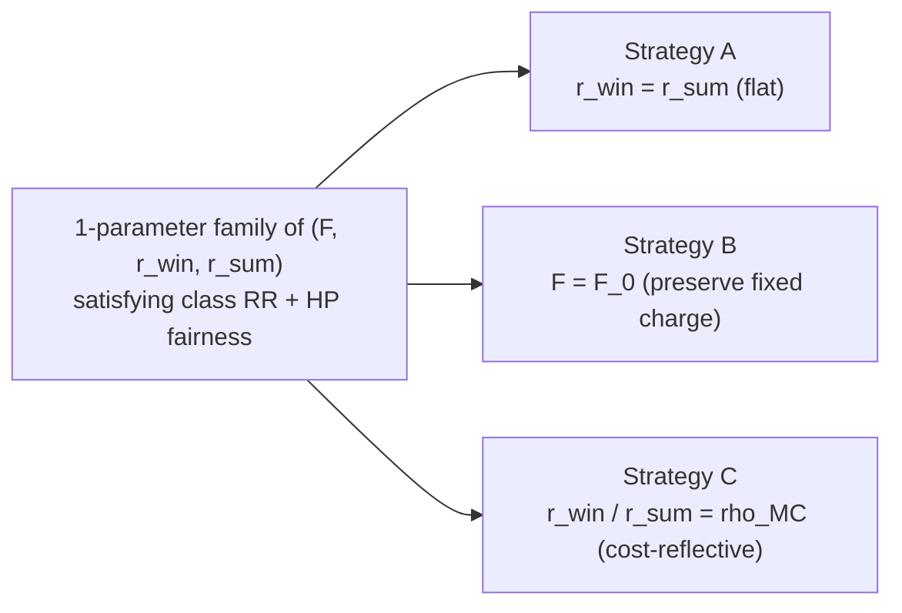

# Fair default rate design: math and closed-form strategies

How to redesign the residential default tariff (a single tariff that applies to **every** residential customer) so that it eliminates the heat-pump cross-subsidy measured by the Bill Alignment Test, while still collecting the class revenue requirement. Three closed-form strategies — fixed-charge only, seasonal-rates only, and a combined cost-reflective design — plus a uniqueness analysis answering the question: "for any given fixed charge, how many seasonal rate pairs satisfy the constraints?".

This is the math behind issue #398 and the upcoming `utils/mid/compute_fair_default_inputs.py` / `utils/mid/create_fair_default_tariff.py` modules.

---

## 1. Why a default tariff (and not a HP-specific one)

Existing seasonal-discount tariffs (`utils/mid/compute_seasonal_discount_inputs.py`) eliminate the HP cross-subsidy by giving HP customers a different tariff from non-HP customers. That works analytically but raises practical and regulatory problems: utilities have to identify HP customers, defend a separate class in rate cases, and maintain dual billing systems. A **fair default** tariff is a single tariff applied to the whole residential class whose structure is chosen so that the HP subclass nets to zero cross-subsidy automatically.

The price of singularity is a smaller design space. With one tariff for everyone, the only knobs are:

- the fixed charge $F$ (\$/customer/month),
- the volumetric rate(s): one flat rate $r$ (\$/kWh), or two seasonal rates $r_{\text{win}}, r_{\text{sum}}$.

The question is whether those knobs have enough flexibility to satisfy two constraints simultaneously — class revenue sufficiency and HP cross-subsidy elimination — and, if so, how to choose among the family of solutions when there are more knobs than constraints.

---

## 2. Setup and notation

All quantities are observed in CAIRO outputs from a calibrated baseline run (e.g. `run-1` for delivery-only, `run-2` for delivery+supply); see `context/code/orchestration/run_orchestration.md` for what each run produces.

Notation is descriptive: the **subclass** subscript is `cls` (whole residential class) or `hp` (heat-pump customers), and quantities are spelled out as `N`, `kWh`, `bill`, etc. so the formulas read like English.

| Symbol | Meaning | Unit | Source |
| --- | --- | --- | --- |
| $N_{\text{cls}}, N_{\text{hp}}$ | weighted number of customers (class, HP) | customers | `customer_metadata.csv` (`weight` × group filter) |
| $\text{kWh}_{\text{cls}}, \text{kWh}_{\text{hp}}$ | weighted annual kWh (class, HP) | kWh/yr | `scan_resstock_loads`, summed over the year |
| $\text{kWh}^{\text{win}}_{\text{cls}}, \text{kWh}^{\text{win}}_{\text{hp}}$ | weighted **winter** kWh | kWh/yr | same, restricted to winter months $\mathcal{H}_{\text{win}}$ |
| $\text{kWh}^{\text{sum}}_{\text{cls}}, \text{kWh}^{\text{sum}}_{\text{hp}}$ | weighted **summer** kWh | kWh/yr | same, restricted to summer months $\mathcal{H}_{\text{sum}}$ |
| $\text{Bill}_{\text{cls}}, \text{Bill}_{\text{hp}}$ | weighted **current** annual bill (class, HP) under baseline tariff | \$/yr | `bills/elec_bills_year_target.csv` |
| $X_{\text{hp}}$ | weighted HP **cross-subsidy** (overcharge) under baseline tariff | \$/yr | `cross_subsidization/cross_subsidization_BAT_values.csv` |
| $F_0$ | baseline calibrated fixed charge | \$/customer/month | `_extract_fixed_charge_from_urdb` on `_calibrated.json` |
| $\rho_{MC}$ | load-weighted winter/summer marginal-cost ratio | dimensionless | `context/methods/tou_and_rates/cost_reflective_tou_rate_design.md` |

The seasonal split $\mathcal{H}_{\text{win}}, \mathcal{H}_{\text{sum}}$ is the per-utility winter/summer month set defined in the periods YAML (`utils/pre/season_config.py`), the same one used by the seasonal-discount workflow. Annual = winter + summer:

$$\text{kWh}_{\text{cls}} = \text{kWh}^{\text{win}}_{\text{cls}} + \text{kWh}^{\text{sum}}_{\text{cls}}, \qquad \text{kWh}_{\text{hp}} = \text{kWh}^{\text{win}}_{\text{hp}} + \text{kWh}^{\text{sum}}_{\text{hp}}.$$

**Sign convention for $X_{\text{hp}}$:** $X_{\text{hp}} > 0$ means HP customers are **overcharged** under the current tariff (their bill exceeds their BAT-allocated cost). This matches the existing `compute_subclass_seasonal_discount_inputs` code, where a positive subclass cross-subsidy produces a positive winter discount that reduces HP bills. To eliminate the cross-subsidy, the new tariff must reduce the HP subclass's total bill by exactly $X_{\text{hp}}$ dollars.

**Two derived targets** appear over and over below:

- **Class revenue requirement**, $RR \equiv \text{Bill}_{\text{cls}}$. The baseline default tariff is calibrated to recover RR, so the weighted-sum of current bills equals RR by construction.
- **HP fair allocated cost**, $\text{TC}_{\text{hp}} \equiv \text{Bill}_{\text{hp}} - X_{\text{hp}}$. By the cross-subsidy sign convention, this is what the HP subclass *should* pay if the residual were allocated by the BAT residual method (`BAT_percustomer`, etc.).

---

## 3. The two constraints

For any candidate new default tariff with fixed charge $F$ and seasonal rates $(r_{\text{win}}, r_{\text{sum}})$, the **class** and **HP** annual bills are linear in the parameters:

$$\text{Bill}_{\text{cls}}^{\text{new}} = \underbrace{12 F \cdot N_{\text{cls}}}_{\text{fixed-charge revenue}} + \underbrace{r_{\text{win}} \cdot \text{kWh}^{\text{win}}_{\text{cls}}}_{\text{winter volumetric}} + \underbrace{r_{\text{sum}} \cdot \text{kWh}^{\text{sum}}_{\text{cls}}}_{\text{summer volumetric}}$$

$$\text{Bill}_{\text{hp}}^{\text{new}} = 12 F \cdot N_{\text{hp}} + r_{\text{win}} \cdot \text{kWh}^{\text{win}}_{\text{hp}} + r_{\text{sum}} \cdot \text{kWh}^{\text{sum}}_{\text{hp}}$$

The two design constraints are:

**(C1) Class revenue sufficiency** — collect the same total revenue as the calibrated baseline:

$$\boxed{\;12 F \cdot N_{\text{cls}} + r_{\text{win}} \cdot \text{kWh}^{\text{win}}_{\text{cls}} + r_{\text{sum}} \cdot \text{kWh}^{\text{sum}}_{\text{cls}} \;=\; RR\;}$$

**(C2) HP cross-subsidy elimination** — charge HP exactly their fair allocated cost:

$$\boxed{\;12 F \cdot N_{\text{hp}} + r_{\text{win}} \cdot \text{kWh}^{\text{win}}_{\text{hp}} + r_{\text{sum}} \cdot \text{kWh}^{\text{sum}}_{\text{hp}} \;=\; \text{TC}_{\text{hp}}\;}$$

**Two equations in three unknowns** $(F, r_{\text{win}}, r_{\text{sum}})$. With three knobs and two constraints there is generically a one-parameter family of solutions. The three strategies below are three different ways of closing that one degree of freedom.

---

## 4. Strategy A — fixed-charge only (flat volumetric)

Force a single flat volumetric rate, $r_{\text{win}} = r_{\text{sum}} = r$. Now we have 2 unknowns ($F, r$) and 2 equations:

$$\begin{pmatrix} 12 N_{\text{cls}} & \text{kWh}_{\text{cls}} \\ 12 N_{\text{hp}} & \text{kWh}_{\text{hp}} \end{pmatrix} \begin{pmatrix} F \\ r \end{pmatrix} = \begin{pmatrix} RR \\ \text{TC}_{\text{hp}} \end{pmatrix}$$

The determinant of the left-hand matrix is

$$\Delta_A \;=\; 12 \cdot \big(N_{\text{cls}} \cdot \text{kWh}_{\text{hp}} - N_{\text{hp}} \cdot \text{kWh}_{\text{cls}}\big).$$

Define the **per-customer kWh** for each group:

$$\overline{\text{kWh}}_{\text{cls}} = \frac{\text{kWh}_{\text{cls}}}{N_{\text{cls}}}, \qquad \overline{\text{kWh}}_{\text{hp}} = \frac{\text{kWh}_{\text{hp}}}{N_{\text{hp}}}.$$

Then $\Delta_A = 12 \cdot N_{\text{cls}} \cdot N_{\text{hp}} \cdot (\overline{\text{kWh}}_{\text{hp}} - \overline{\text{kWh}}_{\text{cls}})$. Since $N_{\text{cls}}, N_{\text{hp}} > 0$ always, the sign of the determinant is the sign of $(\overline{\text{kWh}}_{\text{hp}} - \overline{\text{kWh}}_{\text{cls}})$.

By Cramer's rule, the absolute solution is

$$F^*_A = \frac{RR \cdot \text{kWh}_{\text{hp}} - \text{TC}_{\text{hp}} \cdot \text{kWh}_{\text{cls}}}{\Delta_A}, \qquad r^*_A = \frac{\text{TC}_{\text{hp}} \cdot N_{\text{cls}} - RR \cdot N_{\text{hp}}}{\Delta_A / 12}.$$

The same answer expressed as a **delta from the baseline** $(F_0, r_0)$ — using $RR = 12 F_0 N_{\text{cls}} + r_0 \text{kWh}_{\text{cls}}$ and $\text{Bill}_{\text{hp}} = 12 F_0 N_{\text{hp}} + r_0 \text{kWh}_{\text{hp}}$ — is much more readable:

$$\Delta F_A \;=\; F^*_A - F_0 \;=\; \frac{-X_{\text{hp}}}{12 \cdot N_{\text{hp}} \cdot \big(1 - \overline{\text{kWh}}_{\text{hp}} / \overline{\text{kWh}}_{\text{cls}}\big)}, \qquad \Delta r_A \;=\; r^*_A - r_0 \;=\; \frac{X_{\text{hp}}}{\text{kWh}_{\text{hp}} \cdot \big(1 - \overline{\text{kWh}}_{\text{cls}} / \overline{\text{kWh}}_{\text{hp}}\big)}.$$

**Number of solutions.**

- If $\overline{\text{kWh}}_{\text{hp}} \ne \overline{\text{kWh}}_{\text{cls}}$ (i.e. $\Delta_A \ne 0$): **exactly one** solution $(F^*_A, r^*_A)$.
- If $\overline{\text{kWh}}_{\text{hp}} = \overline{\text{kWh}}_{\text{cls}}$ and $X_{\text{hp}} = 0$: **infinitely many** — the two constraints become the same equation and any $(F, r)$ on the line $12 F N_{\text{cls}} + r \text{kWh}_{\text{cls}} = RR$ works.
- If $\overline{\text{kWh}}_{\text{hp}} = \overline{\text{kWh}}_{\text{cls}}$ and $X_{\text{hp}} \ne 0$: **zero** solutions — the two constraints are parallel but inconsistent. With identical per-customer kWh you cannot redistribute by changing $F$ vs $r$, so no flat tariff can eliminate a nonzero HP cross-subsidy.

In practice HP customers consume more electricity per customer than the class average (electrification of heating shifts therms onto kWh), so $\overline{\text{kWh}}_{\text{hp}} > \overline{\text{kWh}}_{\text{cls}}$ and the answer is always exactly one.

**Sign intuition.** With $\overline{\text{kWh}}_{\text{hp}} > \overline{\text{kWh}}_{\text{cls}}$ and HP currently overcharged ($X_{\text{hp}} > 0$): $\Delta F_A < 0$ and $\Delta r_A > 0$ — *cut* the fixed charge, *raise* the volumetric rate. A fixed-charge cut benefits everyone equally in dollars, but as a percentage of bill it benefits high-kWh HP customers more strongly; a volumetric raise hurts in proportion to kWh (HP has more), but the math works out so that net dollars flow from non-HP to HP.

**Failure mode.** If $F^*_A < 0$ (or below a regulatory floor like \$5/month), the strategy is infeasible at face value; report the floor-clipped $F$ and the residual cross-subsidy that remains.

---

## 5. Strategy B — seasonal rates only ($F = F_0$ preserved)

Hold the fixed charge at the calibrated baseline value $F_0$. The two unknowns are now the seasonal rates $(r_{\text{win}}, r_{\text{sum}})$:

$$\begin{pmatrix} \text{kWh}^{\text{win}}_{\text{cls}} & \text{kWh}^{\text{sum}}_{\text{cls}} \\ \text{kWh}^{\text{win}}_{\text{hp}} & \text{kWh}^{\text{sum}}_{\text{hp}} \end{pmatrix} \begin{pmatrix} r_{\text{win}} \\ r_{\text{sum}} \end{pmatrix} = \begin{pmatrix} RR - 12 F_0 N_{\text{cls}} \\ \text{TC}_{\text{hp}} - 12 F_0 N_{\text{hp}} \end{pmatrix}$$

The determinant is

$$D \;=\; \text{kWh}^{\text{win}}_{\text{cls}} \cdot \text{kWh}^{\text{sum}}_{\text{hp}} \;-\; \text{kWh}^{\text{win}}_{\text{hp}} \cdot \text{kWh}^{\text{sum}}_{\text{cls}}.$$

This determinant has a beautiful factorization. Define the **winter share** of each group:

$$\sigma_{\text{cls}} \;=\; \frac{\text{kWh}^{\text{win}}_{\text{cls}}}{\text{kWh}_{\text{cls}}} \quad (\text{class winter share}), \qquad \sigma_{\text{hp}} \;=\; \frac{\text{kWh}^{\text{win}}_{\text{hp}}}{\text{kWh}_{\text{hp}}} \quad (\text{HP winter share}).$$

Then $\text{kWh}^{\text{win}}_{\text{cls}} = \sigma_{\text{cls}} \text{kWh}_{\text{cls}}$, $\text{kWh}^{\text{sum}}_{\text{cls}} = (1 - \sigma_{\text{cls}}) \text{kWh}_{\text{cls}}$, and likewise for HP. Substituting and simplifying:

$$\boxed{\;D \;=\; \text{kWh}_{\text{cls}} \cdot \text{kWh}_{\text{hp}} \cdot \big(\sigma_{\text{cls}} - \sigma_{\text{hp}}\big)\;}$$

Since $\text{kWh}_{\text{cls}}, \text{kWh}_{\text{hp}} > 0$ always, **the sign of $D$ is the sign of $(\sigma_{\text{cls}} - \sigma_{\text{hp}})$**:

| Condition on winter shares | Sign of $D$ | When this happens in practice |
| --- | --- | --- |
| $\sigma_{\text{hp}} = \sigma_{\text{cls}}$ — HP and class have the same winter/summer split | $D = 0$ | **Degenerate.** Never with real heat pumps. |
| $\sigma_{\text{hp}} > \sigma_{\text{cls}}$ — HP is **more winter-heavy** than class | $D < 0$ | **The realistic heat-pump case.** HP shifts heating onto the electric meter in winter, making $\sigma_{\text{hp}} \approx 0.65{-}0.75$ vs class $\sigma_{\text{cls}} \approx 0.55{-}0.60$ in NY/RI. |
| $\sigma_{\text{hp}} < \sigma_{\text{cls}}$ — HP is **less winter-heavy** than class | $D > 0$ | Subclasses without winter electrification — e.g. solar/EV-only customers or summer-AC-heavy subclasses. |

By Cramer's rule:

$$r^*_{\text{win},B} = \frac{(RR - 12 F_0 N_{\text{cls}}) \cdot \text{kWh}^{\text{sum}}_{\text{hp}} - (\text{TC}_{\text{hp}} - 12 F_0 N_{\text{hp}}) \cdot \text{kWh}^{\text{sum}}_{\text{cls}}}{D}, \qquad r^*_{\text{sum},B} = \frac{(\text{TC}_{\text{hp}} - 12 F_0 N_{\text{hp}}) \cdot \text{kWh}^{\text{win}}_{\text{cls}} - (RR - 12 F_0 N_{\text{cls}}) \cdot \text{kWh}^{\text{win}}_{\text{hp}}}{D}.$$

In **delta form** (writing $\Delta r_{\text{win},B} = r^*_{\text{win},B} - r_0$, where $r_0$ is the baseline equivalent flat rate, and similarly for summer; the structure is unchanged for a seasonal baseline because (C1) and (C2) are linear):

$$\boxed{\;\Delta r_{\text{win},B} \;=\; \frac{X_{\text{hp}} \cdot \text{kWh}^{\text{sum}}_{\text{cls}}}{D}, \qquad \Delta r_{\text{sum},B} \;=\; \frac{-X_{\text{hp}} \cdot \text{kWh}^{\text{win}}_{\text{cls}}}{D}\;}$$

**Number of solutions.**

- If $\sigma_{\text{hp}} \ne \sigma_{\text{cls}}$ (i.e. $D \ne 0$): **exactly one** solution $(r^*_{\text{win},B}, r^*_{\text{sum},B})$.
- If $\sigma_{\text{hp}} = \sigma_{\text{cls}}$ and the right-hand side happens to be consistent (which requires $X_{\text{hp}} = 0$, i.e. HP is already not cross-subsidized): **infinitely many** solutions — the whole class-RR line in $(r_{\text{win}}, r_{\text{sum}})$-space works.
- If $\sigma_{\text{hp}} = \sigma_{\text{cls}}$ and $X_{\text{hp}} \ne 0$: **zero** solutions — no seasonal rate pair can fix the cross-subsidy because winter-vs-summer is exactly the wrong lever (the two groups respond identically to seasonal price changes).

In practice $\sigma_{\text{hp}} > \sigma_{\text{cls}}$ by a substantial margin, so the answer is always exactly one.

**Sign intuition (HP case, $D < 0$, $X_{\text{hp}} > 0$).**

- $\Delta r_{\text{win},B} = X_{\text{hp}} \cdot \text{kWh}^{\text{sum}}_{\text{cls}} / D < 0$ — **cut** the winter rate.
- $\Delta r_{\text{sum},B} = -X_{\text{hp}} \cdot \text{kWh}^{\text{win}}_{\text{cls}} / D > 0$ — **raise** the summer rate.

That matches intuition. HP customers are over-paying ($X_{\text{hp}} > 0$) because the calibrated default tariff prices winter kWh too dearly relative to their (high) winter consumption. Lowering $r_{\text{win}}$ helps HP relatively more than it helps non-HP (HP has higher $\sigma_{\text{hp}}$); raising $r_{\text{sum}}$ recovers the lost revenue mostly from non-HP (non-HP has the higher summer share). Net effect: revenue flows from non-HP to HP, with class RR preserved.

**Failure mode.** Negative seasonal rates. The closed form does not enforce $r_{\text{win}}, r_{\text{sum}} \ge 0$. If, say, $r^*_{\text{win},B} < 0$ — meaning the algebraically-required winter rate is a *credit* — we cannot legally publish it. Two options:

1. **Clip to zero** and recompute the other rate from the class RR constraint alone, then report the residual cross-subsidy that the clipped tariff still leaves uncorrected.
2. **Fall back to Strategy A** (the discriminant for A is independent of $D$, so one strategy may be feasible when the other is not).

---

## 6. Strategy C — combined, with a cost-reflective seasonal ratio

Use all three knobs $(F, r_{\text{win}}, r_{\text{sum}})$ but close the one remaining degree of freedom by enforcing a **cost-reflective** seasonal ratio:

$$\frac{r_{\text{win}}}{r_{\text{sum}}} \;=\; \rho_{MC},$$

where $\rho_{MC}$ is the load-weighted marginal cost ratio between winter and summer, computed on system MC and class load following the methodology in `context/methods/tou_and_rates/cost_reflective_tou_rate_design.md`:

$$\rho_{MC} \;=\; \frac{\overline{MC}_{\text{win}}}{\overline{MC}_{\text{sum}}} \;=\; \frac{\sum_{h \in \mathcal{H}_{\text{win}}} MC_h \cdot L_h \,\big/\, \sum_{h \in \mathcal{H}_{\text{win}}} L_h}{\sum_{h \in \mathcal{H}_{\text{sum}}} MC_h \cdot L_h \,\big/\, \sum_{h \in \mathcal{H}_{\text{sum}}} L_h}.$$

Substitute $r_{\text{win}} = \rho_{MC} \cdot r_{\text{sum}}$ into (C1) and (C2). Define the **MC-weighted kWh** per group:

$$\widetilde{\text{kWh}}_{\text{cls}} \;=\; \rho_{MC} \cdot \text{kWh}^{\text{win}}_{\text{cls}} + \text{kWh}^{\text{sum}}_{\text{cls}}, \qquad \widetilde{\text{kWh}}_{\text{hp}} \;=\; \rho_{MC} \cdot \text{kWh}^{\text{win}}_{\text{hp}} + \text{kWh}^{\text{sum}}_{\text{hp}}.$$

(These are what each group's annual kWh would be if winter kWh were "weighted up" by the MC ratio — they collapse the seasonal split into a single cost-equivalent kWh number per group.) Then (C1) and (C2) become:

$$\begin{pmatrix} 12 N_{\text{cls}} & \widetilde{\text{kWh}}_{\text{cls}} \\ 12 N_{\text{hp}} & \widetilde{\text{kWh}}_{\text{hp}} \end{pmatrix} \begin{pmatrix} F \\ r_{\text{sum}} \end{pmatrix} = \begin{pmatrix} RR \\ \text{TC}_{\text{hp}} \end{pmatrix}.$$

This is **structurally identical to Strategy A** with $\widetilde{\text{kWh}}$ in place of $\text{kWh}$. Determinant:

$$\Delta_C \;=\; 12 \cdot \big(N_{\text{cls}} \cdot \widetilde{\text{kWh}}_{\text{hp}} - N_{\text{hp}} \cdot \widetilde{\text{kWh}}_{\text{cls}}\big) \;=\; 12 \cdot N_{\text{cls}} \cdot N_{\text{hp}} \cdot \big(\overline{\widetilde{\text{kWh}}}_{\text{hp}} - \overline{\widetilde{\text{kWh}}}_{\text{cls}}\big).$$

By Cramer's rule:

$$F^*_C = \frac{RR \cdot \widetilde{\text{kWh}}_{\text{hp}} - \text{TC}_{\text{hp}} \cdot \widetilde{\text{kWh}}_{\text{cls}}}{\Delta_C}, \qquad r^*_{\text{sum},C} = \frac{\text{TC}_{\text{hp}} \cdot N_{\text{cls}} - RR \cdot N_{\text{hp}}}{\Delta_C / 12}, \qquad r^*_{\text{win},C} = \rho_{MC} \cdot r^*_{\text{sum},C}.$$

**Number of solutions.** Same as Strategy A but with MC-weighted kWh:

- If $\overline{\widetilde{\text{kWh}}}_{\text{hp}} \ne \overline{\widetilde{\text{kWh}}}_{\text{cls}}$ (i.e. $\Delta_C \ne 0$): **exactly one** $(F, r_{\text{sum}})$, hence one $(F, r_{\text{win}}, r_{\text{sum}})$.
- If $\overline{\widetilde{\text{kWh}}}_{\text{hp}} = \overline{\widetilde{\text{kWh}}}_{\text{cls}}$ and $X_{\text{hp}} = 0$: **infinitely many.**
- If $\overline{\widetilde{\text{kWh}}}_{\text{hp}} = \overline{\widetilde{\text{kWh}}}_{\text{cls}}$ and $X_{\text{hp}} \ne 0$: **zero.**

The non-degeneracy condition is a positive linear combination of the Strategy A condition (per-customer kWh differs) and the Strategy B condition (winter share differs), so $\Delta_C = 0$ requires both Strategies A and B to be on the boundary of degeneracy. Effectively never happens.

**Why this is the right closure.** Among the one-parameter family of (C1,C2)-feasible tariffs, this point is the one whose seasonal differential matches the cost-causation differential. It is the single member of the family that simultaneously (i) collects RR, (ii) zeros the HP cross-subsidy, and (iii) sends the seasonal price signal that an ideal cost-reflective two-period tariff would send. It is the natural "best of both worlds" point on the line of feasible tariffs.

---

## 7. The one-parameter family and uniqueness theorem

The user's question — "for a given fixed charge, are there zero, one, or infinitely many seasonal rate pairs that satisfy the two constraints?" — has a clean algebraic answer.

**Theorem.** Fix any value of $F$. Then (C1) and (C2) restricted to the unknowns $(r_{\text{win}}, r_{\text{sum}})$ form a $2 \times 2$ linear system

$$\begin{pmatrix} \text{kWh}^{\text{win}}_{\text{cls}} & \text{kWh}^{\text{sum}}_{\text{cls}} \\ \text{kWh}^{\text{win}}_{\text{hp}} & \text{kWh}^{\text{sum}}_{\text{hp}} \end{pmatrix} \begin{pmatrix} r_{\text{win}} \\ r_{\text{sum}} \end{pmatrix} = \begin{pmatrix} RR - 12 F N_{\text{cls}} \\ \text{TC}_{\text{hp}} - 12 F N_{\text{hp}} \end{pmatrix}$$

with determinant

$$D \;=\; \text{kWh}^{\text{win}}_{\text{cls}} \cdot \text{kWh}^{\text{sum}}_{\text{hp}} - \text{kWh}^{\text{win}}_{\text{hp}} \cdot \text{kWh}^{\text{sum}}_{\text{cls}} \;=\; \text{kWh}_{\text{cls}} \cdot \text{kWh}_{\text{hp}} \cdot \big(\sigma_{\text{cls}} - \sigma_{\text{hp}}\big).$$

The number of solutions $(r_{\text{win}}, r_{\text{sum}})$ depends only on $D$ and the right-hand side:

| Case | Condition | Number of seasonal-rate pairs $(r_{\text{win}}, r_{\text{sum}})$ that satisfy both (C1) and (C2) |
| --- | --- | --- |
| **Generic, non-degenerate** | $D \ne 0$, i.e. $\sigma_{\text{hp}} \ne \sigma_{\text{cls}}$ | **Exactly one.** The system is invertible; $(r_{\text{win}}, r_{\text{sum}})$ is given by Cramer's rule above. |
| **Degenerate, consistent** | $D = 0$ ($\sigma_{\text{hp}} = \sigma_{\text{cls}}$) AND $X_{\text{hp}} = 0$ | **Infinitely many.** The two constraints reduce to a single equation; any $(r_{\text{win}}, r_{\text{sum}})$ on a line in 2D works. |
| **Degenerate, inconsistent** | $D = 0$ ($\sigma_{\text{hp}} = \sigma_{\text{cls}}$) AND $X_{\text{hp}} \ne 0$ | **Zero.** The two constraints become parallel-but-offset; no seasonal rate pair satisfies both. (You'd need to change $F$.) |

**In the heat-pump case the answer is always exactly one,** because heat-pump electrification of heating makes $\sigma_{\text{hp}}$ meaningfully larger than $\sigma_{\text{cls}}$ ($\sigma_{\text{hp}} \approx 0.65{-}0.75$ vs $\sigma_{\text{cls}} \approx 0.55{-}0.60$ in NY/RI), so $D < 0 \ne 0$.

**Geometric picture.** As $F$ varies over $\mathbb{R}$, the unique solution $(r_{\text{win}}(F), r_{\text{sum}}(F))$ traces an affine line in 3-space. Strategies A, B, C are three named points on this line:

Other reasonable closures (regulatorily fix $F$ at \$10/month, fix the winter rate at the marginal energy cost, enforce $r_{\text{sum}} \ge $ a fuel-cost floor, etc.) give still other named points on the same line. The framework is the same: pick any one extra constraint to close the system, get a unique closed-form $(F, r_{\text{win}}, r_{\text{sum}})$.

**Why "exactly one" matters.** It tells us this is not a problem that needs a numerical optimizer or a search. Any policy choice that adds one scalar constraint immediately yields a closed-form solution by Cramer's rule. The hard problem is choosing the right closure (A vs B vs C, or some hybrid), not solving the equations once it's chosen.

---

## 8. Feasibility region

The closed-form solutions are real numbers; we still need them to be physically meaningful as a tariff. The feasibility constraints are:

$$F \ge F_{\min}^{\text{reg}} \ge 0, \qquad r_{\text{win}} \ge 0, \qquad r_{\text{sum}} \ge 0$$

(with possibly $F_{\min}^{\text{reg}} > 0$ representing a regulatory floor on the fixed charge).

Along the one-parameter family $\{(F, r_{\text{win}}(F), r_{\text{sum}}(F))\}$, each non-negativity constraint is a linear inequality in $F$, defining a half-line. The intersection is an interval $F \in [F_{\min}, F_{\max}]$ (possibly empty). Concretely:

- $r_{\text{win}}(F) = r_{\text{win}}(0) + a_{\text{win}} F$ for some slope $a_{\text{win}}$, so $r_{\text{win}} \ge 0$ becomes $F \le -r_{\text{win}}(0)/a_{\text{win}}$ (or $\ge$, depending on the sign of $a_{\text{win}}$).
- Similarly for $r_{\text{sum}}(F)$.
- $F \ge F_{\min}^{\text{reg}}$ closes the lower end.

The output of `utils/mid/compute_fair_default_inputs.py` will report $[F_{\min}, F_{\max}]$ explicitly so downstream sensitivity analysis can plot the feasible family. If $F^*_A$, $F_0$, or $F^*_C$ falls outside $[F_{\min}, F_{\max}]$, the corresponding strategy is infeasible without rate clipping.

---

## 9. Worked example (illustrative)

Numbers are stylized to show how the formulas behave; an actual RIE example using current run-1 outputs will be filled in once the modules land.

Suppose, for a residential class with $N_{\text{cls}} = 400{,}000$ customers:

- Class: $\text{kWh}_{\text{cls}} = 4 \cdot 10^9$, $\text{kWh}^{\text{win}}_{\text{cls}} = 2.4 \cdot 10^9$ (winter share $\sigma_{\text{cls}} = 60\%$), $\text{kWh}^{\text{sum}}_{\text{cls}} = 1.6 \cdot 10^9$
- HP subclass: $N_{\text{hp}} = 40{,}000$, $\text{kWh}_{\text{hp}} = 6 \cdot 10^8$ (15% of class kWh from 10% of customers), $\text{kWh}^{\text{win}}_{\text{hp}} = 4.5 \cdot 10^8$ (winter share $\sigma_{\text{hp}} = 75\%$), $\text{kWh}^{\text{sum}}_{\text{hp}} = 1.5 \cdot 10^8$
- Calibrated baseline: $F_0 = \$15$/month, equivalent flat $r_0 = 0.16$ \$/kWh ⇒ $RR = 12 \cdot 15 \cdot 400{,}000 + 0.16 \cdot 4 \cdot 10^9 = \$712\text{M}$
- Current HP bill: $\text{Bill}_{\text{hp}} = 12 \cdot 15 \cdot 40{,}000 + 0.16 \cdot 6 \cdot 10^8 = \$103.2\text{M}$
- HP overcharge from BAT: $X_{\text{hp}} = +\$5\text{M}$ ⇒ $\text{TC}_{\text{hp}} = \$98.2\text{M}$

Plug into the closed forms:

- **Strategy A.** $\overline{\text{kWh}}_{\text{cls}} = 10{,}000$, $\overline{\text{kWh}}_{\text{hp}} = 15{,}000$. $\Delta_A = 12 \cdot 4 \cdot 10^5 \cdot 4 \cdot 10^4 \cdot (15{,}000 - 10{,}000) = 9.6 \cdot 10^{14}$. Solving gives $F^*_A \approx \$13.96$/month, $r^*_A \approx 0.1605$ \$/kWh — a small reduction in the fixed charge and a small bump in the volumetric.
- **Strategy B** (preserve $F_0 = 15$). $D = \text{kWh}_{\text{cls}} \cdot \text{kWh}_{\text{hp}} \cdot (\sigma_{\text{cls}} - \sigma_{\text{hp}}) = 4 \cdot 10^9 \cdot 6 \cdot 10^8 \cdot (0.60 - 0.75) = -3.6 \cdot 10^{17}$. The negative determinant gives $r^*_{\text{win},B}$ slightly **below** $r_0$ and $r^*_{\text{sum},B}$ slightly **above** — HP's winter-heaviness is the lever.
- **Strategy C** with stylized $\rho_{MC} = 1.4$ (winter MC 40% above summer). $\widetilde{\text{kWh}}_{\text{cls}} = 1.4 \cdot 2.4 \cdot 10^9 + 1.6 \cdot 10^9 = 4.96 \cdot 10^9$, $\widetilde{\text{kWh}}_{\text{hp}} = 1.4 \cdot 4.5 \cdot 10^8 + 1.5 \cdot 10^8 = 7.8 \cdot 10^8$. Solve the $2 \times 2$ for $(F^*_C, r^*_{\text{sum},C})$ and recover $r^*_{\text{win},C} = 1.4 \cdot r^*_{\text{sum},C}$.

The point is qualitative: all three closed forms are pencil-and-paper computable from the inputs CSV. The implementation just plumbs the formulas; there is no optimizer in the loop.

---

## 10. Limitations and extensions

- **Single subclass.** The framework eliminates one cross-subsidy (HP). If multiple subclasses (HP, electric resistance heat, EV-only) all need zeroing simultaneously, the constraint count grows and the design space (fixed + 2 seasonal rates) is no longer rich enough — TOU or tiered structures, or simultaneous adjustments to multiple class-wide parameters, become necessary. Multi-subclass elimination is left to a follow-up issue.
- **Flat-vs-seasonal only.** Strategies A/B/C assume a flat-or-2-period-seasonal tariff. Adding TOU within seasons (peak/off-peak) introduces more knobs and more cost-reflectiveness, but also more degrees of freedom to close. The natural extension is "Strategy D" with $(F, r_{\text{win,peak}}, r_{\text{win,off}}, r_{\text{sum,peak}}, r_{\text{sum,off}})$ closed by enforcing both the seasonal ratio and the within-season peak ratio against $\rho_{MC}$ and the TOU cost-causation ratios from `context/methods/tou_and_rates/cost_reflective_tou_rate_design.md`.
- **Delivery vs supply.** Run-1 outputs cover delivery; run-2 covers delivery+supply. The strategies above can be applied to either, producing `_default_fair_<strategy>.json` and `_default_fair_<strategy>_supply.json` tariffs respectively. The supply variant uses the same math with supply-only $X_{\text{hp}}$ and supply-only baseline bills.
- **Interaction with downstream LMI discount.** Apply the LMI tier credit *after* the fair-default tariff is constructed (the LMI credit is a flat per-tier dollar discount). The fair-default math is unchanged; the LMI credit reduces realized revenue but is funded outside the class RR, consistent with the existing `utils/post/apply_ny_lmi_to_master_bills.py` workflow.
- **Calibration drift.** The closed forms assume CAIRO's calibrated bills exactly recover RR and the BAT residual exactly equals $\text{TC}_{\text{hp}}$. In practice CAIRO's iterative calibration leaves small (sub-percent) residuals; the tariff produced from this math will need a final calibration pass, identical to the precalc step used by the seasonal-discount workflow.

---

## 11. Cross-references

**Implementation (planned):**

- [`utils/mid/compute_fair_default_inputs.py`](utils/mid/compute_fair_default_inputs.py) — emits the inputs CSV with $N_{\text{cls}}, N_{\text{hp}}, \text{kWh}^{\text{win}}_{\text{cls}}, \text{kWh}^{\text{win}}_{\text{hp}}, \text{kWh}^{\text{sum}}_{\text{cls}}, \text{kWh}^{\text{sum}}_{\text{hp}}, RR, \text{Bill}_{\text{hp}}, X_{\text{hp}}, \rho_{MC}$ and the closed-form $F^*_A$, $r^*_A$, $r^*_{\text{win},B}$, $r^*_{\text{sum},B}$, $F^*_C$, $r^*_{\text{win},C}$, $r^*_{\text{sum},C}$ plus the feasible interval $[F_{\min}, F_{\max}]$.
- [`utils/mid/create_fair_default_tariff.py`](utils/mid/create_fair_default_tariff.py) — wraps `create_flat_rate` (Strategy A) and `create_seasonal_rate` (B, C) from [`utils/pre/create_tariff.py`](utils/pre/create_tariff.py); injects the new $F$ via a small `_with_fixed_charge` helper.
- Reuses helpers from [`utils/mid/compute_subclass_rr.py`](utils/mid/compute_subclass_rr.py): `_load_subclass_cross_subsidy_inputs` (for $X_{\text{hp}}$ and HP weights), `_extract_fixed_charge_from_urdb` (for $F_0$), and the seasonal kWh load-aggregation pattern from `compute_subclass_seasonal_discount_inputs` (extended to compute class totals in the same scan).

**Methodology context:**

- [`context/methods/bat_mc_residual/bat_lrmc_residual_allocation_methodology.md`](context/methods/bat_mc_residual/bat_lrmc_residual_allocation_methodology.md) — definition and decomposition of $X_{\text{hp}}$ from the BAT framework.
- [`context/methods/tou_and_rates/cost_reflective_tou_rate_design.md`](context/methods/tou_and_rates/cost_reflective_tou_rate_design.md) — derivation of $\rho_{MC}$ as the load-weighted seasonal MC ratio.
- [`context/code/orchestration/seasonal_discount_rate_workflow.md`](context/code/orchestration/seasonal_discount_rate_workflow.md) — the analogous subclass-tariff workflow that this default-tariff workflow generalizes.
- GitHub issue [#398](https://github.com/switchbox-data/rate-design-platform/issues/398) — original motivating ticket.
