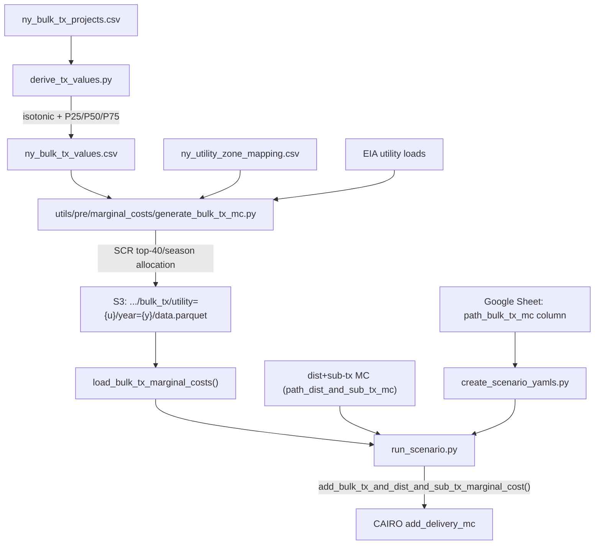

# Incorporate Bulk Tx Costs in NYISO

Closes #302. This adds bulk transmission marginal costs derived from NYISO AC Transmission and LI Export studies, smeared into 8760 hourly traces using SCR top-40-per-season peak hours. Transmission is treated as a delivery charge (combined with dist+sub-tx MC) and active in delivery-only runs.

## Naming conventions (current — final)

| Old name (in original plan) | Current name in code |

|---|---|

| `path_transmission_mc` | `path_bulk_tx_mc` (ScenarioSettings field, YAML key, Google Sheet column) |

| `path_td_marginal_costs` | `path_dist_and_sub_tx_mc` (ScenarioSettings field, YAML key, Google Sheet column) |

| `load_transmission_marginal_costs()` | `load_bulk_tx_marginal_costs()` in `utils/cairo.py` |

| distribution MC loader | `load_dist_and_sub_tx_marginal_costs()` in `utils/cairo.py` |

| `add_t_and_d_marginal_cost()` | `add_bulk_tx_and_dist_and_sub_tx_marginal_cost()` in `utils/cairo.py` |

| `path_td_mc` (Justfile variable) | `path_dist_and_sub_tx_mc` (shared Justfile variable, value points to `dist_and_sub_tx/` S3 prefix) |

| `path_s3_mc_output` (Justfile) | Points to `dist_and_sub_tx/` S3 prefix |

| `path_transmission_mc` (Justfile variable) | Not in shared Justfile; `path_bulk_tx_mc` in `ny/Justfile` (overrides shared empty default) |

| S3: `.../transmission/` | S3: `.../bulk_tx/` (output from `utils/pre/marginal_costs/generate_bulk_tx_mc.py`) |

| `transmission_cost_enduse` (output column) | `bulk_tx_cost_enduse` (output parquet column in bulk tx files) |

| `dist_and_sub_tx_cost_enduse` (implicit) | `dist_and_sub_tx_cost_enduse` (output parquet column in dist+sub-tx files) |

| `create-td-mc-data` (recipe) | `create-dist-and-sub-tx-mc-data` (shared + ny Justfile) |

| `create-tx-mc-data` (recipe) | `create-bulk-tx-mc-data` (ny Justfile) |

| `create-tx-mc-data-all` (recipe) | `create-bulk-tx-mc-data-all` (ny Justfile) |

| `--path-td-marginal-costs` (derive_seasonal_tou.py) | `--path-dist-and-sub-tx-mc` |

## S3 file layout (confirmed from S3 inspection 2026-03-02)

| MC type | S3 path pattern | Filename | Status |

|---|---|---|---|

| dist+sub-tx | `s3://data.sb/switchbox/marginal_costs/ny/dist_and_sub_tx/utility={u}/year=2026/` | `data.parquet` | ✓ uploaded (cenhud, nyseg, rge) |

| supply energy | `s3://data.sb/switchbox/marginal_costs/ny/supply/energy/utility={u}/year=2025/` | `00000000.parquet` | ✓ uploaded (all 7 utilities) |

| supply capacity | `s3://data.sb/switchbox/marginal_costs/ny/supply/capacity/utility={u}/year=2025/` | `00000000.parquet` | ✓ uploaded (all 7 utilities) |

| bulk tx | `s3://data.sb/switchbox/marginal_costs/ny/bulk_tx/utility={u}/year=2025/` | `data.parquet` | ✗ not yet uploaded |

Note: supply MC files use `00000000.parquet` (written by Polars `write_parquet` to a partitioned directory). The Justfile `path_supply_energy_mc` / `path_supply_capacity_mc` in `ny/Justfile` are set to `00000000.parquet` to match. The YAML sheet formula also uses `00000000.parquet` — both are correct.

## Architecture



## Why an interface benefit maps to a load zone (not a physical line)

The NYISO AC Transmission studies report Annual Benefits at **interfaces** (e.g. UPNY-ConEd, Total Export) -- these are corridor-level transfer capability increments, not zone-level costs. The question is: how do we assign a $/kW-yr to a load zone from an interface-level study?

The answer is the same principle as ICAP: **the value is assigned to the load zone whose customers benefit from the expanded transfer capability**, not to where the transmission line physically sits.

- **ICAP analogy**: An ICAP locality price (e.g. NYC = $12/kW-mo) reflects the marginal value of capacity _to serve load in that zone_. A generator in Zone J receives the NYC ICAP price because it contributes to NYC load-serving adequacy. Similarly, a transmission expansion across the UPNY-ConEd interface benefits _downstate load_ (access to cheaper upstate generation), so the transmission value is assigned to zones G-K.
- **The studies already partition by locality**: The issue table reports Annual Benefit broken out by NYISO locality (A-F, G-K, K). This is NYISO's own decomposition of _who benefits from each MW of transfer capability_. We use these locality-level benefits directly.
- **ROS (Upstate, A-F)**: The AC Primary studies show net-negative incremental benefit for A-F from projects designed to export power downstate. The NYISO study is therefore not used for ROS. Instead, we use the three NiMo 2025 MCOS bulk TX projects (≥230 kV) with **undiluted** $/kW-yr per project MW — the same approach as generation capacity MC. The three undiluted values ($78.42, $40.21, $10.89 /kW-yr) feed directly into the average-secant derivation pipeline (Steps 1–2), yielding v_avg ≈ $10.89/kW-yr (single project, Niagara-Dysinger only).
- **Multi-locality utilities (ConEd)**: Same weighting as ICAP -- ConEd is 87% NYC + 13% LHV by capacity obligation (from zone mapping). The utility-level v_z is the weighted blend.

This is exactly how `gen_capacity_zone` works in [`data/nyiso/zone_mapping/generate_zone_mapping_csv.py`](data/nyiso/zone_mapping/generate_zone_mapping_csv.py) -- the `capacity_weight` column already encodes the split for multi-zone utilities.

## 1. Raw project data and principled v_z derivation

### 1a. Raw project-level data table

Create [`data/nyiso/transmission/ny_bulk_tx_projects.csv`](data/nyiso/transmission/ny_bulk_tx_projects.csv) encoding every row from the issue's Year x Scenario x Project x Locality table. Columns: `year`, `scenario`, `project`, `locality`, `annual_benefit_m_yr` (float), `delta_mw` (float or null), `notes`. This is the immutable record of the NYISO study inputs. Upload to `s3://data.sb/nyiso/transmission/ny_bulk_tx_projects.csv`.

**Validation (1a)**:

- All required columns present and correctly typed
- `locality` values are in expected set: {`A-F`, `G-K`, `K`, `NYCA`, `UPNY-ConEd`, `G-J`}
- `annual_benefit_m_yr` is numeric (negative values allowed for A-F, which represent procurement cost increases)
- `delta_mw` is positive where present, null only for rows where the study does not report incremental MW
- Print row count, unique scenarios, unique localities, and range of benefits as summary

### 1b. Derive v_z per locality using Steps 1-3 from the issue

Implement the derivation in [`data/nyiso/transmission/derive_tx_values.py`](data/nyiso/transmission/derive_tx_values.py):

**Step 1 -- Discrete marginal values**: For each project with published `delta_mw`, compute `v = B / (delta_mw * 1000)` ($/kW-yr). Drop rows where `delta_mw` is null.

**Validation (Step 1)**:

- v values are in plausible range (flag any v > 100 $/kW-yr or v < -20 $/kW-yr with a warning)
- Print per-project v values for inspection

**Step 2 -- Average secant of the diminishing-returns curve**: Group by `(locality, scenario_family)`. Within each group:

1. Collapse scenario variants: if multiple rows share the same `(project, delta_mw)` (e.g. Baseline vs CES+Ret for the same project), average their `annual_benefit_m_yr` first.
2. Sort collapsed projects by ΔMW ascending (diminishing-returns order).
3. Compute cumulative (cum_ΔMW, cum_B) at each step; secant_i = cum_B_i × 1000 / cum_ΔMW_i ($/kW-yr).
4. v_avg = mean(secant_i).

This gives less influence to a single large-ΔMW low-v project than a simple mean or MW-weighted average would, because that project only appears in the last cumulative secant.

**Note:** isotonic regression (previously Step 3) has been removed. The average-secant method captures the same diminishing-returns intuition without requiring sklearn and without forcing monotonicity constraints.

**Step 4 -- Aggregate to gen_capacity_zone**: Map issue localities to gen_capacity_zone (see table below). For each zone, pick the representative v_z values.

**Validation (Step 4)**:

- LHV < NYC ordering holds (both from NYISO interface studies; NYC congestion value exceeds LHV)
- ROS > 0 (NiMo MCOS data must be present)
- No strict ordering between ROS and LHV/LI — they derive from different data sources (NiMo MCOS infrastructure LRMC vs NYISO interface-benefit studies) and cannot be directly compared
- Print final summary table with all four zones

### Locality -> gen_capacity_zone mapping for derivation

| gen_capacity_zone | Localities/families (by receiving_locality) | Derivation approach | v_avg |

|---|---|---|---|

| ROS | ROS/nimo_mcos (recv=ROS) | Niagara-Dysinger only. Smart Path Connect and Eastover have recv=G-K → LHV+LI. | $10.89/kW-yr |

| LHV | G-K/nimo_mcos (recv=G-K), G-K/ac_primary (recv=G-K), G-J/addendum_optimizer (recv=G-J), K/li_export (recv=G-J) | G-K projects + Addendum Optimizer + LI Export (LI export cables benefit mainland G-J load, not LI). Zone v_avg = mean of four family values. | $46.20/kW-yr |

| NYC | UPNY-ConEd/mmu (recv=J) | MMU Baseline+CES+Ret averaged per project. J-only studies; G-J projects excluded from NYC to avoid corridor dilution. | $53.53/kW-yr |

| LI | G-K/nimo_mcos (recv=G-K), G-K/ac_primary (recv=G-K) | Only G-K projects (G-K spans zones G–K, includes zone K = LI). LI Export projects have recv=G-J → go to LHV, not LI. | $52.17/kW-yr |

Default column used for 8760 smearing: `v_avg_kw_yr`. CLI `--v-z-quantile avg` (only option).

### 1c. Data pipeline Justfile

`data/nyiso/transmission/Justfile` with recipes: `derive` (runs `derive_tx_values.py`), `upload` (syncs CSVs to S3).

## 2. New module: `utils/pre/marginal_costs/generate_bulk_tx_mc.py`

Mirrors [`utils/pre/marginal_costs/generate_supply_capacity_mc.py`](utils/pre/marginal_costs/generate_supply_capacity_mc.py) pattern:

- **Inputs**: Zone mapping (same CSV), utility loads (same S3 base + load functions imported from [`generate_utility_tx_dx_mc.py`](utils/pre/marginal_costs/generate_utility_tx_dx_mc.py)), derived v_z table (CSV on S3 or local), year
- **v_z lookup**: Load `ny_bulk_tx_values.csv`, join utility -> `gen_capacity_zone` via zone mapping (with `capacity_weight` for multi-locality utilities like ConEd: 87% NYC + 13% LHV), select the chosen quantile column

**Validation (v_z lookup)**:

- Every utility has exactly one resolved v_z value (after weighting)
- v_z > 0 for all utilities (ROS utilities get ~$10/kW-yr, not zero)
- Print utility -> gen_capacity_zone -> v_z mapping for inspection

- **SCR allocation** (from issue Steps A-B):
  - Summer = months 5-10, Winter = months 11-12 + 1-4
  - Top 40 hours per season by utility load -> 80 SCR hours total
  - Load-weighted smear: `w_t = load_t / sum(load in SCR hours)`; `pi_t = v_z * w_t` for `t in SCR`

**Validation (SCR hours)**:

- Exactly 40 hours per season, 80 total
- SCR hours are non-overlapping between seasons (no hour appears in both)
- Print month distribution of SCR hours (summer should cluster in Jul-Aug, winter in Jan-Feb)
- Print top-5 SCR hours per season with their loads and weights

**Validation (smeared trace)**:

- Weights sum to 1.0 within tolerance (0.01%)
- 1 kW constant load test: `sum(pi_t * 1 kW * 1 hour) == v_z` (same pattern as [`validate_allocation`](utils/pre/marginal_costs/supply_capacity.py) and [`validate_allocation`](utils/pre/marginal_costs/generate_utility_tx_dx_mc.py))
- Non-zero hours == 80
- All non-zero values are positive
- Average non-zero cost is in a reasonable range (v_z / 80 * some factor)

- **Output**: `s3://data.sb/switchbox/marginal_costs/ny/bulk_tx/utility={utility}/year={YYYY}/data.parquet`
  - Schema: `timestamp` (datetime), `bulk_tx_cost_enduse` ($/MWh), 8760 rows
- **CLI**: `--utility`, `--year`, `--v-z-table-path`, `--zone-mapping-path`, `--v-z-quantile mid`, `--upload`, etc.

**Validation (output)**:

- 8760 rows, no nulls
- Schema matches expected (timestamp, bulk_tx_cost_enduse)
- Sum of bulk_tx_cost_enduse / 1000 == v_z for flat 1 kW load (converting $/MWh back to $/kW-yr)
- Print summary: avg $/MWh, max $/MWh, non-zero hours count

## 3. Update zone mapping CSV generator

Add `tx_locality` column to [`data/nyiso/zone_mapping/generate_zone_mapping_csv.py`](data/nyiso/zone_mapping/generate_zone_mapping_csv.py). For now `tx_locality` = `gen_capacity_zone` (they share the same zone grouping). This keeps the door open if transmission localities diverge later.

**Validation**: Assert `tx_locality` is in {`ROS`, `LHV`, `NYC`, `LI`} for all rows.

## 4. MC loading: `utils/cairo.py`

Add delivery MC loading utilities with shared index alignment logic:

- **`load_dist_and_sub_tx_marginal_costs(path)`**: Load dist+sub-tx MC parquet, convert $/MWh → $/kWh, return Series with EST timezone
- **`load_bulk_tx_marginal_costs(path)`**: Load bulk transmission MC parquet (column `bulk_tx_cost_enduse`), convert $/MWh → $/kWh, return Series with EST timezone
- **`_align_mc_to_index(mc_series, target_index, mc_type)`**: Shared helper for aligning any MC Series to a target DatetimeIndex. Handles same-length position alignment (common when MC file year differs from run year) and reindexing for different lengths.
- **`add_bulk_tx_and_dist_and_sub_tx_marginal_cost(path_dist_and_sub_tx_mc, path_bulk_tx_mc, target_index)`**: High-level function that loads both MCs, aligns them to target index, sums them into a single delivery MC Series, and validates. This encapsulates all delivery MC loading logic, keeping `run_scenario.py` clean.

**Design principles**:

- Single responsibility: each function has one clear purpose
- Shared utilities: `_align_mc_to_index` eliminates duplication between distribution and transmission alignment
- Clean separation: all MC loading/alignment logic lives in `utils/cairo.py`, not in run scripts

**Validation (loader)**:

- 8760 rows, no nulls
- All values >= 0
- Sum is in expected range for the utility (log it; exact check is in generate step)
- Timestamps are monotonically increasing and span one year

## 5. Update `run_scenario.py`

- `path_dist_and_sub_tx_mc: str | Path` in `ScenarioSettings` (short form, no `_marginal_costs` suffix)
- `path_bulk_tx_mc: str | Path | None = None` in `ScenarioSettings`
- `path_supply_energy_mc` and `path_supply_capacity_mc` are now the only supply MC fields; `path_supply_marginal_costs` and `path_cambium_marginal_costs` are fully removed
- In scenario loading, parse all four fields from YAML; `_load_supply_marginal_costs()` detects Cambium vs NYISO paths internally
- Single call to `add_bulk_tx_and_dist_and_sub_tx_marginal_cost()`:
  ```python
  dist_and_sub_tx_marginal_costs = add_bulk_tx_and_dist_and_sub_tx_marginal_cost(
      path_dist_and_sub_tx_mc=settings.path_dist_and_sub_tx_mc,
      path_bulk_tx_mc=settings.path_bulk_tx_mc,
      target_index=pd.DatetimeIndex(bulk_marginal_costs.index),
  )
  ```

## 6. Update `create_scenario_yamls.py`

- Reads `path_bulk_tx_mc` and `path_dist_and_sub_tx_mc` from Google Sheet columns (canonical names)
- `path_supply_marginal_costs` / `path_cambium_marginal_costs` columns fully removed from output
- Google Sheet formula documentation in module docstring — see `utils/pre/create_scenario_yamls.py`

## 7. Justfiles

### Shared Justfile (`rate_design/hp_rates/Justfile`)

- `path_dist_and_sub_tx_mc` variable: points to `dist_and_sub_tx/` S3 prefix (→ `data.parquet`)
- `path_bulk_tx_mc := ""` (empty default; NY overrides)
- `path_supply_energy_mc := path_cambium` (default for RI; NY overrides to NYISO path)
- `path_supply_capacity_mc := path_cambium` (default for RI; NY overrides to NYISO path)
- `create-dist-and-sub-tx-mc-data` recipe: invokes `utils/pre/marginal_costs/generate_utility_tx_dx_mc.py`
- `s` dispatch: fixed to invoke `just -f <state>/Justfile` so state-specific overrides are active

### NY-specific Justfile (`rate_design/hp_rates/ny/Justfile`)

- `path_bulk_tx_mc`: `s3://.../bulk_tx/utility={u}/year=2025/data.parquet`
- `path_supply_energy_mc`: `s3://.../supply/energy/utility={u}/year=2025/00000000.parquet`
- `path_supply_capacity_mc`: `s3://.../supply/capacity/utility={u}/year=2025/00000000.parquet`
- `create-bulk-tx-mc-data utility_arg` recipe: calls `utils/pre/marginal_costs/generate_bulk_tx_mc.py`
- `create-bulk-tx-mc-data-all` recipe: runs for all 7 NY utilities

## 8. Validate config

`utils/pre/validate_config.py`:

- `--path-dist-and-sub-tx-mc` (required): compares Justfile variable vs YAML `path_dist_and_sub_tx_mc`
- `--path-bulk-tx-mc` (optional): compares Justfile variable vs YAML `path_bulk_tx_mc` when supplied
- `--path-supply-energy-mc` (optional): compares vs YAML `path_supply_energy_mc` when supplied
- `validate-config` recipe in shared Justfile passes all three

## 9. Tests

`tests/test_bulk_tx_mc.py` exists with comprehensive coverage:

- SCR hour identification: correct count (40/season, 80 total), correct season assignment, non-overlapping, custom hours/months
- Load-weighted smear: weights sum to 1.0, 1 kW constant load recovers v_z, parametrized over multiple v_z values
- v_z table loading and quantile resolution: local CSV, single-zone utility, multi-zone weighted blend, unknown utility raises, all quantile columns
- Output schema: 8760 rows, no nulls, correct schema, preserves 1 kW recovery, correct non-zero count
- Season config: default SCR matches seasonal discount default, matches utility YAML, whole year covered
- Integration with `create_scenario_yamls` (new column round-trips): **not yet covered** — add test confirming `path_bulk_tx_mc` round-trips through the YAML writer

## 10. Context doc

[`context/code/marginal_costs/ny_bulk_tx_marginal_costs.md`](context/code/marginal_costs/ny_bulk_tx_marginal_costs.md) — complete. Added to [`context/README.md`](context/README.md).

## 11. Branch and PR

Branch `feature/bulk-tx-costs` open, draft PR linked to `Closes #302`.

**Close-out steps** (pending):

1. Upload bulk_tx MC parquets: `UTILITY=<u> just s ny create-bulk-tx-mc-data <u>` for all 7 utilities (or `just s ny create-bulk-tx-mc-data-all`)
2. Sync with `main` (`git fetch origin && git merge origin/main` or rebase)
3. Remove draft status from PR, finalize description, merge
