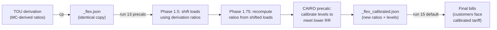
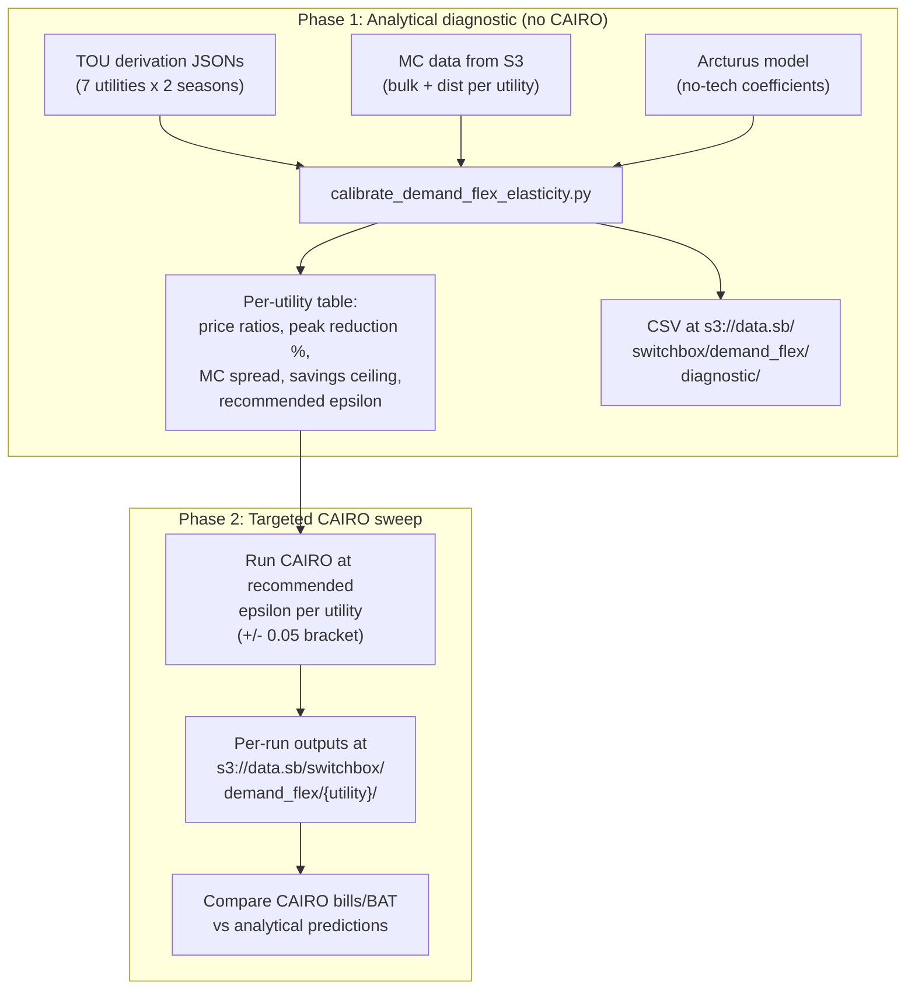

# Demand-Flex Elasticity Calibration: Per-Utility Diagnostic and Sweep

## Status (March 2026)

**Phase 1 complete.** All analytical work is done and validated. PR #382 closed the GitHub issue.

| Deliverable                                                                                              | Status                    |
| -------------------------------------------------------------------------------------------------------- | ------------------------- |
| `utils/post/calibrate_demand_flex_elasticity.py` -- elasticity calibration sweep                         | Done                      |
| `utils/post/validate_demand_flex_shift.py` -- shift validation + diagnostic plots                        | Done                      |
| `rate_design/hp_rates/ny/Justfile` -- `validate-demand-flex`, `calibrate-demand-flex-elasticity` recipes | Done                      |
| `context/methods/tou_and_rates/demand_flex_elasticity_calibration.md` -- methodology writeup             | Done                      |
| Per-utility recommended elasticities (7 utilities)                                                       | Done -- see results table |
| Shift validation across all 7 utilities (energy conservation, direction, CAIRO tracker match)            | Done -- all pass          |
| Diagnostic plots in `dev_plots/flex/{utility}/`                                                          | Done                      |
| Update scenario YAMLs with per-utility elasticities                                                      | **Pending**               |
| Phase 2 CAIRO sweep at recommended elasticities                                                          | Optional / deferred       |

**Recommended elasticities (pending YAML update):**

- ε = -0.10: ConEd, NiMo, NYSEG, RGE (3-hour peak windows)
- ε = -0.12: CenHud, OR, PSEG-LI (5-hour peak windows)

## Problem statement

Bill savings under demand flex at `epsilon = -0.1` are very small. We need to:

1. **Diagnose why** -- is it the elasticity, the MC spread, or both?
2. **Find the right elasticity per utility** -- each utility has different seasonal TOU price ratios, so the same epsilon produces different peak reductions
3. **Quantify the demand shift** -- kWh moved, peak reduction %, seasonal breakdown
4. **Maximize bill savings while remaining realistic** -- anchored to Arcturus "no enabling tech" empirical predictions
5. **Run targeted CAIRO sweeps** to validate and produce final outputs

**The HP overpaying problem**: HP customers have high winter electricity demand (electric heating) while winter marginal costs are generally lower (capacity costs allocated mainly to summer). Under a flat or default rate structure, they overpay relative to their cost causation in winter. The TOU flex tariff gives them the opportunity to shift load away from peak hours, but: (a) the peak/offpeak spread they can arbitrage is smaller in winter than summer, and (b) we are constrained to a single annual elasticity value in the scenario YAMLs.

## Key data: TOU price ratios vary widely across utilities

From the TOU derivation JSONs (`[ny/config/tou_derivation/](rate_design/hp_rates/ny/config/tou_derivation/)`):

| Utility  | Winter Ratio | Winter Peak Hours | Summer Ratio | Summer Peak Hours |
| -------- | ------------ | ----------------- | ------------ | ----------------- |
| ConEd    | 2.0          | 16-18 (3h)        | 4.3          | 15-17 (3h)        |
| CenHud   | 1.6          | 16-20 (5h)        | 3.0          | 15-19 (5h)        |
| NiMo     | 1.8          | 17-19 (3h)        | 2.9          | 17-19 (3h)        |
| (5 more) | ...          | ...               | ...          | ...               |

A single `epsilon = -0.1` produces very different peak reductions depending on the ratio. Arcturus "no enabling tech" predictions at these ratios:

- `peak_reduction = -0.011 + (-0.065) * ln(price_ratio)`
- 1.6:1 -> ~4.2% peak reduction
- 2.0:1 -> ~5.6%
- 3.0:1 -> ~8.2%
- 4.3:1 -> ~10.6%

## CAIRO model constraints

From [`context/code/cairo/cairo_demand_flexibility_workflow.md`](context/code/cairo/cairo_demand_flexibility_workflow.md) and [`context/code/cairo/demand_flex_residual_treatment.md`](context/code/cairo/demand_flex_residual_treatment.md):

- **Constant elasticity**: `Q* = Q * (P_period / P_flat)^epsilon` -- same response for all buildings
- **Single receiver period** per season: all shifted load goes to one off-peak sink
- **Exogenous MC prices**: load shifting changes total MC dollars, not prices
- **Frozen residual**: only the MC component of the RR adjusts; non-MC infrastructure costs held constant
- **Zero-sum**: kWh shifted, not reduced

There are two distinct bill savings mechanisms:

1. **RR reduction** (system-level, small): under frozen residual, shifting reduces total MC -> lower RR -> lower rates for all (or for the HP subclass under subclass RR). This is `Sigma_h MC_h * (L_orig_h - L_shifted_h)`. Small because HP share is small.
2. **Rate arbitrage** (per-customer, primary): HP customers on a TOU tariff shift load from expensive peak hours to cheap offpeak hours. Savings = `kWh_shifted * (peak_rate - offpeak_rate)`. This is independent of the RR change -- it's the TOU rate structure creating an incentive. Compared to each utility's current default rate structure, this is where meaningful per-customer savings come from.

## Tariff calibration feedback loop

The calibrated tariff customers face is an **output** of the demand-flex process, not a fixed input. The chain:



Example for ConEd (from actual files):

- **Derivation ratios** (from MC, input to run 13): winter 1.978, summer 4.332
- **Flex calibrated ratios** (output of run 13, input to run 15): winter 2.014, summer 4.143
- Summer ratio **compressed by ~4.4%** because shifting load out of peak reduced the demand-weighted peak MC
- Summer peak rate dropped from $0.318 to $0.299/kWh (lower RR + compressed ratio)

**Implications for the sweep:**

1. The analytical diagnostic uses derivation ratios (first-order); actual customer outcomes use calibrated ratios (second-order feedback ~5%). Good enough for targeting.
2. The CAIRO sweep **must run the full 13 -> copy-calibrated -> 15 chain** per elasticity, not just run 13 alone. Runs 15-16 produce the actual customer bills.
3. The diagnostic should predict how much Phase 1.75 compresses the ratio at each elasticity (larger elasticity = more shift = more compression).

## Architecture: two phases



## Phase 1: Calibration on real load data (`utils/post/calibrate_demand_flex_elasticity.py`)

New script. Uses actual ResStock building loads, customer metadata, and MC data for all 7 NY utilities. Focuses on the **runs 13-14 scenario** (precalc with HP/non-HP subclasses), which reflects the realistic world where only HP buildings (`postprocess_group.has_hp=True`) are on the TOU flex tariff and subject to demand shifting. HP buildings are a small fraction of each utility's customer base -- this is the primary reason bill savings are small.

Runs 15-16 model a counterfactual 100% HP adoption world; calibration should target runs 13-14.

For each of the 7 NY utilities, for each season, for each elasticity in `[-0.05, -0.10, -0.15, -0.20]`:

**Demand shift metrics (per utility, per season, per elasticity):**

- HP building count and weighted customer share (% of utility total)
- HP peak period kWh before and after shift
- Peak reduction (% of HP peak kWh) -- the Arcturus-comparable metric
- kWh shifted peak-to-offpeak (absolute)
- System-level peak impact (% of total utility peak, dampened by HP share)
- Demand-weighted annual price ratio (weighted by HP seasonal kWh; used as the Arcturus calibration anchor since we are constrained to a single annual elasticity)
- Per-season Arcturus peak reduction at per-season price ratios (informational, not used for calibration)
- Annual Arcturus peak reduction at the demand-weighted annual ratio (calibration target)
- Delta: our model's prediction vs Arcturus (identifies over/under-response)
- HP-specific effective TOU ratios vs derivation ratios (flags if derivation used system-wide loads that differ from HP-only loads)

**Financial metrics (two distinct savings mechanisms):**

_Rate arbitrage savings (primary, per-HP-customer):_

- kWh shifted from peak to offpeak per HP customer (demand-weighted average)
- Bill savings from rate structure = kWh_shifted x (peak_rate - offpeak_rate) per season
- Annual per-HP-customer bill savings from rate arbitrage
- This uses the TOU derivation rates, not calibrated rates (first-order; CAIRO calibration adjusts these)
- Comparison baseline: the current default rate structure for each utility (varies by utility)

_RR reduction savings (secondary, system-level):_

- HP subclass MC delta ($) = sum_h(MC_h x shift_h) for HP buildings only (demand-weighted)
- Per-HP-customer RR savings = HP_MC_delta / HP_weighted_count (under subclass RR)
- This is small because HPs are a small share of all customers

_MC data context (NOT Cambium -- all derived from NYISO LBMP and utility PUC filings):_

- NY uses 5 utility-specific MC components: supply energy/NYISO LBMP (most hours nonzero), supply capacity (96 hours/year), supply ancillary, bulk TX (~80 SCR hours/year), dist+sub-TX (~100 PoP hours/year)
- **Delivery-only runs (13) zero out supply MCs** (`zero.parquet`). Only dist+sub-tx + bulk_tx are active -- extremely peaky, nonzero in only ~100-180 hours. MC-based RR savings from shifting are small because the spread is so concentrated.
- **Delivery+supply runs (14)** include supply energy (NYISO LBMP, nonzero virtually all hours) -- broader MC spread, larger MC savings possible.
- The diagnostic should report nonzero-MC hours and their overlap with TOU peak hours per utility, separately for delivery-only and delivery+supply MC stacks.
- For **rate arbitrage savings** (the primary savings mechanism), the MC stack is irrelevant -- savings come from the peak/offpeak rate spread in the tariff structure itself.

**Tariff feedback metrics (predicting Phase 1.75 effects):**

- Predicted post-shift TOU cost-causation ratio per season (Phase 1.75 compression)
- Demand-weighted P_flat computed from actual HP building loads

**Calibration output:**

- Recommended elasticity per utility: the epsilon where our model's HP peak reduction matches the Arcturus "no tech" prediction for that utility's seasonal price ratio
- Per-HP-customer bill savings at the recommended epsilon
- Binding constraint per utility: is it the MC spread, the HP share, or the peak volume that limits savings?

**Data sources (all local or S3, no CAIRO run needed):**

- **Utility assignment**: `/ebs/data/nrel/resstock/res_2024_amy2018_2_sb/metadata_utility/state=NY/utility_assignment.parquet` -- maps bldg_id to utility
- **Customer metadata**: `/ebs/data/nrel/resstock/res_2024_amy2018_2_sb/metadata/state=NY/upgrade=00/metadata-sb.parquet` -- has `postprocess_group.has_hp`, `weight`
- **HP building hourly loads**: `/ebs/data/nrel/resstock/res_2024_amy2018_2_sb/load_curve_hourly/state=NY/upgrade=00/{bldg_id}_00.parquet` -- local disk, fast reads
- **TOU derivation JSONs**: local at [`ny/config/tou_derivation/`](rate_design/hp_rates/ny/config/tou_derivation/) -- seasonal price ratios and peak hours
- **Delivery MC**: `s3://data.sb/switchbox/marginal_costs/ny/{dist_and_sub_tx,bulk_tx}/utility={util}/year=2025/data.parquet` -- 8760 hourly $/kWh (peaky, ~100-180 nonzero hours)
- **Supply MC** (for delivery+supply analysis only): `s3://data.sb/switchbox/marginal_costs/ny/supply/{energy,capacity}/utility={util}/year=2025/data.parquet` -- NYISO LBMP + capacity; zeroed out in delivery-only runs via `zero.parquet`

**CLI:**

```
uv run python -m utils.post.calibrate_demand_flex_elasticity \
    --state ny \
    --elasticities -0.05,-0.10,-0.15,-0.20 \
    [--output-dir /tmp/demand_flex_diagnostic] \
    [--sample-size N]  # optional: limit HP buildings per utility for faster dev iteration
```

**Key implementation details:**

- Loads utility_assignment + metadata once; groups HP bldg_ids by utility
- Per utility: loads HP building hourly loads from local parquet (e.g. ~2k HP buildings for ConEd, fast from local disk)
- Computes demand-weighted `P_flat` from actual HP loads (same as CAIRO's endogenous computation)
- Applies `process_residential_hourly_demand_response_shift` or equivalent constant-elasticity formula per season
- Loads MC data (dist+sub-tx + bulk_tx) per utility from S3
- Computes HP subclass MC delta = sum_h(MC_h x HP_load_shift_h) using demand-weighted HP system load
- Applies Arcturus formula: `peak_red = -0.011 + (-0.065) * ln(ratio)` for comparison
- Runs the actual constant-elasticity shifting math at each sweep elasticity, computes realized peak reduction, and interpolates the elasticity whose peak reduction best matches Arcturus (not a simple algebraic back-solve, which is imprecise given the multi-period, zero-sum model with endogenous P_flat)

## Empirical ground truth from batch ny_20260325b_r1-16

CAIRO outputs at `s3://data.sb/switchbox/cairo/outputs/hp_rates/ny/all_utilities/ny_20260325b_r1-16/` provide actual bill numbers at `epsilon = -0.1` for all 7 utilities. Key finding for ConEd:

- Run 3+4 (default tariff, no flex): mean elec bill = $2,329/year
- Run 11+12 (TOU, no flex): mean = $1,740/year (TOU structure saves $589)
- Run 15+16 (TOU flex, epsilon=-0.1): mean = $1,729/year (flex adds only $10.51 more savings)

The demand-flex effect at epsilon=-0.1 is ~0.6% of the bill -- confirming the "small savings" concern. The TOU structure change dominates. The diagnostic should:

1. Reproduce this $10.51 analytically (validation)
2. Show how it scales with larger elasticity (sweep)
3. Identify the ceiling (is it MC spread, HP share, or both?)

The bill comparison is: **run 15+16 vs run 11+12** (flex effect alone) and **run 15+16 vs run 3+4** (total effect).

## Phase 2: CAIRO sweep (after Phase 1 results reviewed)

Deferred until Phase 1 results are reviewed. The plan:

1. **Generate sweep scenario YAMLs**: For each utility, create run definitions at the Phase 1-recommended elasticity (and +/- 0.05 bracket = 3 values per utility). Could be a script that patches the existing `scenarios_*.yaml` or generates separate sweep YAMLs. Alternatively, add an `--elasticity` CLI override to `run_scenario.py` (small change: add to `_parse_args`, override in `_resolve_settings`).

2. **Run scope per elasticity**: Minimum = **runs 13 + 15** (precalc then default, delivery-only). Run 13 produces the calibrated tariff; run 15 produces the actual customer bills against that tariff. The full `run-13 -> copy-calibrated-tariff -> run-15` chain must execute per elasticity. Supply runs (14, 16) only needed for the final chosen elasticity.

3. **Output location**: `s3://data.sb/switchbox/demand_flex/ny/{utility}/epsilon={value}/` with Hive-style elasticity partitioning.

4. **Justfile recipe**: `sweep-demand-flex-elasticity` that takes a utility and elasticity list, runs the 13+15 chain at each value.

5. **Diagnostic comparison**: After sweep, compare CAIRO bill outputs against Phase 1 analytical predictions. Key metrics to compare: peak reduction %, calibrated ratio compression, per-customer bill savings. The ratio compression from Phase 1.75 is a useful validation point -- the diagnostic can predict it analytically and the CAIRO sweep produces it empirically.

6. **Compute budget**: 7 utilities x 3 elasticities x 2 runs (13+15) = 42 runs. At ~20 min/run for ConEd (smaller utilities faster), total ~6-10 hours. Parallelizable in delivery/supply pairs per the existing `run-all-parallel-tracks` pattern.

## Files to create/modify

- **Create**: `[utils/post/calibrate_demand_flex_elasticity.py](utils/post/calibrate_demand_flex_elasticity.py)` -- Phase 1 calibration
- **Modify**: `[rate_design/hp_rates/Justfile](rate_design/hp_rates/Justfile)` -- add `calibrate-demand-flex-elasticity` recipe
- **Update**: Linear ticket RDP-175 with evolved scope

## Relationship to existing RDP-175 work

The former synthetic validation/sensitivity scripts (`validate_demand_flex.py`, `sensitivity_demand_flex.py`) were removed -- their mathematical invariant checks were either tautological or fully covered by the real-data calibration and shift validation scripts.

## Known limitations and caveats

These are explicitly acknowledged; the diagnostic output should note them.

1. **Arcturus measures aggregate heterogeneous response; our model applies uniform elasticity.** Arcturus coefficients come from meta-analysis of real TOU pilots where customers have diverse responses. Our model applies the same epsilon to every HP building. The recommended elasticity is therefore an approximation: it targets the same aggregate peak reduction as Arcturus predicts, but the underlying behavioral assumption is different. This should be stated in the diagnostic output.

2. **Arcturus functional form (log-linear) differs from our model (power law).** Arcturus: `peak_red = a + b * ln(ratio)`. Our model: `Q* = Q * (ratio)^epsilon`. These only agree at specific price ratios, not across the full curve. The diagnostic compares at each utility's actual ratio, which is valid; it does not claim to reproduce the full Arcturus response curve.

3. **Annual elasticity is a compromise.** Each utility has different winter and summer ratios, but we use a single annual epsilon. The diagnostic computes a demand-weighted annual ratio (weighted by HP seasonal kWh) as the Arcturus anchor. Per-season peak reductions are reported for context -- they will differ from the annual prediction because the same epsilon applied to different seasonal ratios produces different reductions. Winter ratios are lower, so winter peak reduction will be smaller.

4. **ResStock data I/O.** Loading hourly loads for all HP buildings per utility requires reading hundreds to thousands of local parquet files. This is fast from local disk (~seconds) but the data must be present locally. The `--sample-size` CLI option allows faster development iteration by sampling HP buildings.

5. **Demand shift is identical in delivery vs supply precalc runs.** The `_flex.json` tariff rates are identical between delivery and supply runs; shifting is driven by tariff rates, not MC values. The MC zeroing only affects Phase 1.75 ratio recomputation and Phase 2 RR calibration. The diagnostic therefore computes one shift per elasticity, then branches into delivery-only vs delivery+supply MC savings.

## Open questions for Phase 2

- For the sweep, each elasticity re-runs precalc (run 13) which recalibrates via Phase 1.75. The pre-calibrated `_flex.json` is always the same (copy of the derivation tariff). Only the calibrated output changes. So the sweep is self-contained per elasticity value.
- How to manage 42 calibrated tariff files? One approach: write to a sweep-specific output directory (not the main `config/tariffs/electric/`), parameterized by elasticity, so sweep artifacts don't pollute the main config.
- Should we sweep delivery+supply runs (13+14 -> 15+16) or delivery-only (13 -> 15)? Delivery-only gives the delivery bill savings; adding supply doubles compute time. Recommend delivery-only for the sweep, full 4-run chain only for the final chosen elasticity.
