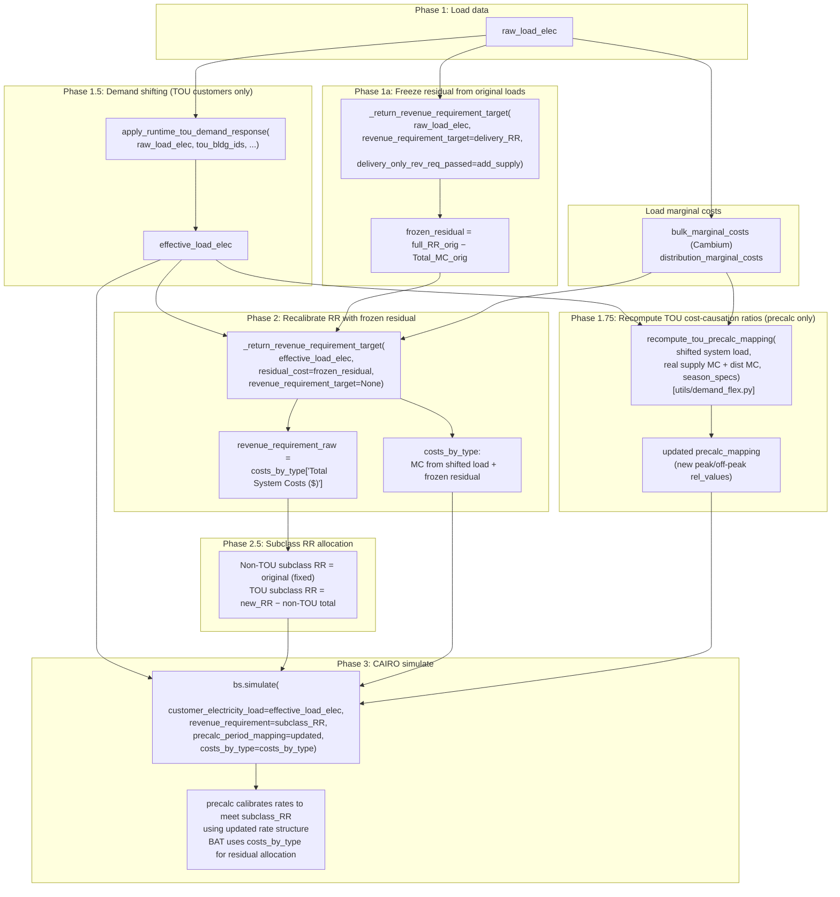

# CAIRO Demand Flexibility Workflow

## Scope

This document summarizes the demand-flexibility (price-response) workflow in CAIRO, including the two-pass revenue requirement recalibration used when demand shifting is enabled.

## Current repo implementation

The core CAIRO demand-response functions are commented out in `cairo/rates_tool/loads.py` (see code references below). This repo has low-level per-building shifting in `utils/cairo.py`:

- `process_residential_hourly_demand_response_shift(...)`
- `_shift_building_hourly_demand(...)`
- runtime wrapper: `apply_runtime_tou_demand_response(...)`

The runtime wrapper supports both:

- full-year TOU shifting, and
- seasonal+TOU shifting (run per season slice, then merge back to 8760).

Equivalent flat tariff is computed endogenously by default for each active slice using class demand weights:

`P_flat = sum_t(Q_t * P_t) / sum_t(Q_t)`

The multi-phase demand-flex orchestration (phases 1a, 1.5, 1.75, 2) lives in `utils/demand_flex.py`. Key exports:

- `apply_demand_flex(...)` — entry point called by `run_scenario.py`; returns a `DemandFlexResult` dataclass
- `is_diurnal_tou(tariff_path)` — detect TOU tariffs with intra-day rate variation
- `find_tou_derivation_path(tariff_key, tou_derivation_dir)` — locate the TOU derivation JSON for a tariff
- `recompute_tou_precalc_mapping(...)` — recompute precalc rel_values from shifted-load MC weights (Phase 1.75)

The scenario entrypoint is `rate_design/hp_rates/run_scenario.py`, which delegates demand-flex orchestration to `utils/demand_flex.py:apply_demand_flex()` and handles the CAIRO simulation.

Primary code references:

- `cairo/rates_tool/loads.py:563` (`process_residential_hourly_demand_response_shift`, commented out)
- `cairo/rates_tool/loads.py:2091` (`_shift_building_hourly_demand`, commented out)
- `cairo/rates_tool/postprocessing.py:1018` (marginal-cost caveat warning)

Related upstream load-period assignment logic:

- `cairo/rates_tool/loads.py:1376` (`_apply_time_indicators_and_periods`)
- `cairo/rates_tool/loads.py:1462` (`_energy_charge_aggregation`)
- `cairo/rates_tool/loads.py:1707` (`_tou_or_tier_energy_charge_aggregation`)

---

## Two-Pass Revenue Requirement Recalibration

When demand flexibility is enabled, a naive single-pass RR calculation with shifted loads would let the residual absorb the MC change from load shifting. Since the residual represents embedded infrastructure costs (debt service, O&M, return on equity, etc.) that don't change with short-run demand response, this is incorrect.

The solution is a two-pass workflow:

### Key details

**Phase 1a — Freeze residual from original loads:**

- Call `_return_revenue_requirement_target` with `raw_load_elec` and the input delivery RR.
- Pass `delivery_only_rev_req_passed=settings.add_supply_revenue_requirement` so the returned `full_rr_orig` includes any supply MC top-up.
- Compute `frozen_residual = full_rr_orig - Total_MC_orig`. This derives the residual from the _full_ topped-up RR, not from `costs_by_type["Residual Costs ($)"]` (which only reflects the delivery-only residual before the supply add-on).
- When `add_supply_revenue_requirement` is False, Cambium bulk MCs are zero, so this reduces to `delivery_RR - dist_MC`. When True, real Cambium MCs are used and the wrapper tops up the RR, but the frozen residual still equals `delivery_RR - dist_MC` by cancellation.

**Phase 1.5 — Apply demand-response load shifting:**

- Only `bldg_ids` assigned to the TOU tariff are shifted; all others pass through unchanged.
- Shifting is energy-conserving (zero-sum within each season).
- Seasonal orchestration: shifting runs per-season slice using explicit `season_specs` or tariff-inferred month groupings.

**Phase 1.75 — Recompute TOU cost-causation ratios from shifted load (precalc only):**

- **Only runs when `run_type == "precalc"`**. Default runs use a pre-calibrated tariff and have no revenue-neutrality constraint to recalibrate — they only apply demand shifting.
- The load shift changes the demand-weighted marginal cost profile, so the peak/off-peak cost-causation ratios change.
- `recompute_tou_precalc_mapping` (`utils/demand_flex.py`) aggregates the shifted building loads to system-level hourly demand, then recomputes per-season `compute_tou_cost_causation_ratio` and `compute_seasonal_base_rates` using the shifted system load.
- **Supply MC source:** For delivery-only precalc runs the scenario's Cambium file may be zeros. The optional YAML field `path_tou_supply_mc` points to the real Cambium parquet; if set, that MC is loaded and combined with distribution MC for cost-causation computation. If unset, `bulk_marginal_costs` (the scenario's Cambium) is used directly — this works for supply runs where the Cambium file is already real.
- For seasons where the combined MC (supply + distribution) is zero everywhere (e.g. winter when distribution capacity costs are allocated only to summer peak hours), the original `base_rate` and `peak_offpeak_ratio` from the TOU derivation spec are preserved.
- The precalc_period_mapping `rel_values` are updated in-place for each TOU tariff. Non-TOU entries are unchanged.
- This ensures CAIRO's precalc calibrates the tariff _structure_ (rate ratios between periods), not just the _level_ (uniform scalar), to reflect post-flex MC responsibility. Without this step, CAIRO would apply a uniform scalar to the original rate ratios, which can cause all period rates to increase even when total RR decreases — because the revenue-weighted load shift exceeds the MC savings.

**Phase 2 — Recompute RR with shifted loads + frozen residual:**

- Call `_return_revenue_requirement_target` with `effective_load_elec`, `residual_cost=frozen_residual`, and `revenue_requirement_target=None`.
- `delivery_only_rev_req_passed=False` because the supply component is already baked into `frozen_residual`.
- The returned `costs_by_type` has correct MC/residual decomposition: `Total System Costs = MC_shifted + frozen_residual`.
- `revenue_requirement_raw = costs_by_type["Total System Costs ($)"]` — this is the system-wide recalibrated RR.

**Phase 2.5 — Subclass RR allocation:**

- When subclass RR ratios are configured (multi-tariff runs like HP TOU + non-HP flat):
  - **With demand flex:** Non-TOU subclasses (e.g. flat) keep their **no-flex baseline** RR: `baseline_k = rr_ratios[k] × full_rr_orig` (from Phase 1a). Using `full_rr_orig` rather than the YAML delivery-only dollar values ensures supply runs get the correct supply-level baseline for non-TOU classes. The TOU subclass(es) absorb the entire RR change: `TOU_RR = revenue_requirement_raw - sum(non-TOU baselines)`. If multiple TOU subclasses exist, the TOU portion is split proportionally by their baselines.
  - **Without demand flex:** The original ratios are applied to `revenue_requirement_raw` as before.
- This ensures the RR decrease from demand flex accrues entirely to the customer class that shifted — the HP class benefits from their flexibility while flat-rate customers are held harmless.

**Phase 3 — CAIRO simulate:**

- Precalc calibrates rate charges so bills from the shifted load profile meet the per-subclass `revenue_requirement`, using the updated `precalc_period_mapping` whose rel_values reflect post-flex MC responsibility.
- BAT postprocessing uses `effective_load_elec` as `raw_hourly_load` together with `marginal_system_prices` and `costs_by_type` to compute per-customer marginal cost allocation, residual allocation, and bill alignment.

**No-flex path:** When `demand_flex_enabled` is False (elasticity == 0), the single-pass call `_return_revenue_requirement_target(raw_load_elec, revenue_requirement_target=delivery_RR)` is unchanged, and the standard subclass ratio split applies.

---

## High-Level Objective

Model short-run customer load shifting under time-varying rates by:

1. Calculating target demand response at tariff period level (by building),
2. Converting those period shifts to hourly shifts proportionally within each period,
3. Preserving total energy (zero-sum shifting),
4. Tracking achieved elasticity for diagnostics.

---

## Function-Level Workflow

## 1) Parent: Period-level shift targets

Function: `process_residential_hourly_demand_response_shift(...)`\
Reference: `cairo/rates_tool/loads.py:563`

Inputs:

- `hourly_load_df`: hourly building load with `bldg_id`, `energy_period`, `tier`, `out.electricity.total.energy_consumption`
- `rate_structure`: period/tier rates with `energy_period`, `tier`, `rate`
- `equivalent_flat_tariff`: baseline flat price
- `demand_elasticity`: price elasticity coefficient (typically negative)

Steps:

1. Aggregate hourly consumption to building-period consumption:
   - Group by `bldg_id`, `energy_period`
2. Join period rates from `rate_structure`.
3. Set baseline price:
   - `rate_orig = equivalent_flat_tariff`
4. Compute target period consumption:
   - `Q_target = Q_orig * (P_period / P_flat)^epsilon`
5. Compute period shift:
   - `load_shift = Q_target - Q_orig`
6. Pivot to matrix indexed by `bldg_id`, columns `(energy_period, tier)`.
7. Identify receiver period:
   - Filter `rate_structure["rate"] < equivalent_flat_tariff`
   - Assert exactly one such `(period, tier)` exists
8. Enforce zero-sum:
   - Receiver shift = negative sum of all other period shifts
9. Dispatch building-level hourly allocation in parallel via Dask:
   - Calls `_shift_building_hourly_demand(...)` per building
10. Concatenate outputs:

- `shifted_load` (hourly adjusted load)
- `demand_elasticity_tracker` (achieved elasticity diagnostics)

Why this design:

- Period-level elasticity model is simpler and more stable than hour-by-hour elasticity.
- Single receiver avoids ambiguous allocation among multiple low-price periods.
- Zero-sum guarantees energy is shifted, not created/destroyed.
- Parallelization scales across large building sets.

---

## 2) Worker: Hourly proportional allocation

Function: `_shift_building_hourly_demand(...)`\
Reference: `cairo/rates_tool/loads.py:2091`

Inputs:

- `load_shift`: target kWh shift per `(energy_period, tier)` for one building
- `hourly_df`: one building's hourly load with `energy_period`, `tier`, original consumption
- `rate_new`: new period/tier rates
- `rate_orig`: equivalent flat baseline price
- `demand_elasticity_target`: passed through, not used directly in computation

Steps:

1. Compute each hour's share of period consumption:
   - `share_hour = Q_hour / Q_period`
2. Merge period shift targets onto hourly rows.
3. Allocate shift proportionally:
   - `shift_hour = shift_period * share_hour`
4. Compute shifted hourly load:
   - `Q_hour_shifted = Q_hour_orig + shift_hour`
5. Validation checks (debug prints):
   - Warn if shifted load falls below 10% of original in any hour
   - Warn if period-level energy conservation appears violated
6. Compute achieved elasticity by `(period, tier)`:
   - `epsilon_achieved = log(Q_new/Q_orig) / log(P_new/P_orig)`
7. Drop intermediate helper columns and return:
   - hourly shifted DataFrame
   - one-row elasticity tracker for the building

Why proportional distribution:

- Preserves intra-period temporal shape.
- Avoids arbitrary hour-picking.
- Keeps shifts physically plausible relative to observed load shape.

---

## Input Derivation and Parameter Setting

The table below focuses on how each input should be derived/set for this module.

| Input                               | How it is derived / set                                                                                                                                                                                                                                                                       | Constraints                                                                                                                                      |
| ----------------------------------- | --------------------------------------------------------------------------------------------------------------------------------------------------------------------------------------------------------------------------------------------------------------------------------------------- | ------------------------------------------------------------------------------------------------------------------------------------------------ |
| `hourly_load_df`                    | Start from raw hourly building load (8760). Map each hour to tariff `energy_period` via tariff schedules (`_apply_time_indicators_and_periods`, `cairo/rates_tool/loads.py:1376`). Ensure `tier` assignment exists for hourly rows (typically from tier/TOU aggregation logic in `loads.py`). | Must include `bldg_id`, `energy_period`, `tier`, `out.electricity.total.energy_consumption`. One building-year of complete hourly data expected. |
| `rate_structure`                    | Construct period/tier price table corresponding to the tariff under analysis. For TOU/tier tariffs this should reflect effective prices used for behavior response.                                                                                                                           | Must include unique `energy_period`, `tier`, `rate` combinations.                                                                                |
| `equivalent_flat_tariff` (`P_flat`) | In this repo runtime implementation, defaults to endogenous class-weighted TOU price for the active slice: `sum_t(Q_t * P_t) / sum_t(Q_t)`. Can still be passed explicitly when needed.                                                                                                       | Must be strictly positive.                                                                                                                       |
| `demand_elasticity` (`epsilon`)     | Exogenous behavioral parameter. Typical short-run residential ranges noted in comments: about `-0.1` to `-0.3`.                                                                                                                                                                               | Usually negative; magnitude controls shift intensity. Constant elasticity assumption.                                                            |
| receiver period                     | Derived internally as periods where `rate < equivalent_flat_tariff`; asserted to be exactly one row.                                                                                                                                                                                          | Assertion fails if zero or multiple receiving periods.                                                                                           |
| period-level `load_shift`           | Derived internally as `Q_target - Q_orig`.                                                                                                                                                                                                                                                    | Enforced zero-sum by assigning receiver period to negative sum of all others.                                                                    |
| hourly shift scalar                 | Derived internally as `Q_hour / Q_period` within each period/tier.                                                                                                                                                                                                                            | Requires non-zero period totals for stable division.                                                                                             |
| achieved elasticity tracker         | Derived internally from post-shift totals and price ratios.                                                                                                                                                                                                                                   | Diagnostic output; should be compared against input `demand_elasticity`.                                                                         |

---

## Mathematical Framework

### A) Period-level demand response

For building `b`, period `p`:

- Baseline period load: `Q_{b,p}`
- New period price: `P_p`
- Baseline equivalent flat price: `P_flat`
- Elasticity: `epsilon`

Target:

`Q^*_{b,p} = Q_{b,p} * (P_p / P_flat)^{epsilon}`

Shift:

`Delta_{b,p} = Q^*_{b,p} - Q_{b,p}`

Zero-sum enforcement (single receiver period `r`):

`Delta_{b,r} = - sum_{p != r} Delta_{b,p}`

So:

`sum_p Delta_{b,p} = 0`

### B) Hourly allocation within period

For hour `h` in period `p`:

- Hour share:
  `w_{b,h} = Q_{b,h} / sum_{k in p} Q_{b,k}`
- Hourly shift:
  `delta_{b,h} = Delta_{b,p} * w_{b,h}`
- Shifted hourly load:
  `Q'_{b,h} = Q_{b,h} + delta_{b,h}`

### C) Realized elasticity diagnostic

For period/tier:

`epsilon_realized = log(Q_new / Q_orig) / log(P_new / P_orig)`

(Implementation uses `log10`, which is equivalent for ratio-of-logs.)

### D) Revenue requirement recalibration

- `frozen_residual = full_RR_orig - MC_orig` (from original loads)
- `new_RR_system = MC_shifted + frozen_residual`
- Algebraically: `new_RR_system = full_RR_orig + (MC_shifted - MC_orig) = full_RR_orig + delta_MC`

### E) Subclass RR allocation (demand flex)

With subclass RR configured (e.g. HP TOU + non-HP flat):

- `baseline_k = rr_ratios[k] × full_RR_orig` (no-flex baseline from Phase 1a, works for both delivery and supply)
- `RR_nonTOU = sum(baseline_k for k not in TOU)` (fixed — these customers didn't shift)
- `RR_TOU = new_RR_system - RR_nonTOU` (TOU class absorbs the full change)
- If multiple TOU subclasses: `RR_TOU_k = RR_TOU * (baseline_k / sum(baseline_TOU))`

---

## Assumptions and Justifications

1. Short-run temporal substitution, not long-run conservation/efficiency.\
   Justification: zero-sum shift design.

2. Constant elasticity across load levels and times.\
   Justification: simple, tractable behavioral model.

3. Single receiving period.\
   Justification: avoids ambiguous allocation but can under-represent multi-period shifting behavior.

4. Proportional hourly redistribution.\
   Justification: preserves observed shape and avoids arbitrary redistribution.

5. Marginal prices are exogenous.\
   `postprocessing.py:1018` warns that fixed marginal prices may be inconsistent with rate-responsive loads. In this workflow the MC prices (Cambium + distribution) are exogenous inputs that don't change with load shifting — only total MC dollars change. The two-pass recalibration ensures the RR and `costs_by_type` are consistent with the shifted load shape.

6. Residual costs are invariant to short-run demand response.\
   The residual (embedded infrastructure, debt service, O&M) is frozen from original loads. Only the marginal component of the RR adjusts to reflect load shifting.

---

## Practical Parameter Guidance

1. Set `equivalent_flat_tariff` as a baseline comparator price:
   - recommended: load-weighted average effective energy rate under baseline usage.
2. Start `demand_elasticity` in conservative short-run range:
   - residential pilot values around `-0.1` to `-0.2`.
3. Ensure tariff design yields one clear low-price sink period if using current logic.
4. Validate post-run:
   - energy conservation by building,
   - reasonable min shifted load,
   - achieved elasticity near target.

---

## Known Gaps / Caveats

1. CAIRO's upstream demand-response implementation remains commented out in core CAIRO (`loads.py`).
2. Interaction with fully endogenous marginal-cost feedback loops is still limited (prices are treated as exogenous).
