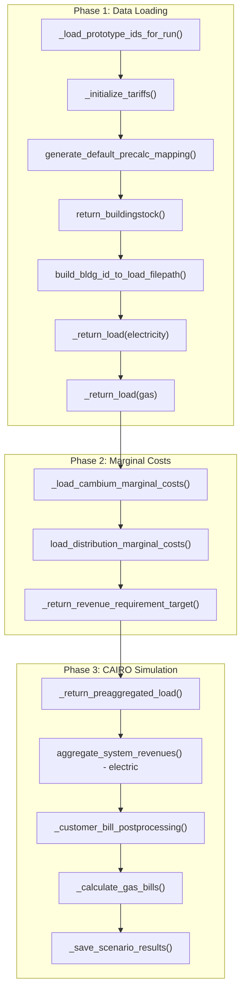

# CAIRO performance analysis

Performance profile of the CAIRO code paths invoked by `run_scenario.py` (RI heat pump
scenarios), identifying compute-intensive stages, parallelism status, and speedup
opportunities ordered by implementation difficulty.

**See also:** [GitHub #250](https://github.com/switchbox-data/rate-design-platform/issues/250) for the broader CAIRO performance investigation; Tier 0 (Dask process scheduler) is implemented.

Based on code at `.venv/lib/python3.13/site-packages/cairo/rates_tool/`.

## Execution flow overview

The `run()` function in `rate_design/hp_rates/run_scenario.py` proceeds in three
phases. The call graph applies to all scenario YAML configs (e.g.
`config/scenarios/scenarios_rie.yaml`).



## Compute-intensive stages (ranked by cost)

| Stage                                 | Location               | Times called     | Per-bldg work                | Dask?          | Effective parallelism      |
| ------------------------------------- | ---------------------- | ---------------- | ---------------------------- | -------------- | -------------------------- |
| `_return_load` (I/O + process)        | loads.py:325           | 2 (elec + gas)   | Read parquet + timestamp ops | Yes (threaded) | Partial (I/O overlap only) |
| `process_building_demand_by_period`   | loads.py:410           | 2-3              | Tariff aggregation (CPU)     | Yes (threaded) | **Single-core** (GIL)      |
| `run_system_revenues`                 | system_revenues.py:116 | 2-3              | Bill calc (CPU)              | Yes (threaded) | **Single-core** (GIL)      |
| `_precalc_customer_rates`             | system_revenues.py:202 | 1 (precalc only) | Unity-rate bills (CPU)       | Yes (threaded) | **Single-core** (GIL)      |
| `_return_cross_subsidization_metrics` | postprocessing.py:624  | 1                | N x 8760 merge + groupby     | No             | **Single-core**            |
| `process_residential_hourly_demand`   | loads.py:522           | 1                | N x 8760 groupby             | No             | **Single-core**            |

### How Dask is used (and why it doesn't help)

CAIRO uses `dask.delayed` + `dask.compute` in four places (load reading, load
aggregation, bill calculation, precalc bills). In each case it wraps per-building worker
functions in `dask.delayed` and calls `dask.compute` on the list.

**No Dask scheduler is ever configured** -- no `dask.config.set()`, no
`scheduler=` argument to `compute()`. This means the default **threaded scheduler**
is used. For CPU-bound pandas/numpy work, threads provide zero parallelism due to the
Python GIL.

### `process_workers` is unused

Every YAML config sets `process_workers: 20`. This value is stored on
`MeetRevenueSufficiencySystemWide` as `self.process_workers` but **never referenced**
anywhere in the CAIRO codebase. It is not passed to Dask and has no effect on execution.

## Speedup opportunities by difficulty

### Tier 0: One-line setting / config changes (no CAIRO internals touched)

#### 0a. Set Dask scheduler to "processes" in `run_scenario.py`

Add one line before any CAIRO call:

```python
import dask
dask.config.set(scheduler="processes", num_workers=settings.process_workers)
```

This makes every `dask.compute()` inside CAIRO use a process pool, bypassing the GIL.

- **Affects**: `process_hourly_demand_by_bldg`, `process_building_demand_by_period`,
  `run_system_revenues`, `_precalc_customer_rates`
- **Estimated speedup**: ~`min(cpu_cores, N_buildings)`x on those stages. On a 10-core
  Mac with 100 buildings, roughly 8-10x for the parallelized stages.
- **Caveat**: Process-based parallelism pickles each delayed task's arguments (one
  8760-row DataFrame per building). The serialization overhead is small relative to the
  work, but worth benchmarking.

### Tier 1: Data type / minor code tweaks (individual lines in CAIRO)

#### 1a. Remove gratuitous `.copy()` calls

Several hot-path functions copy DataFrames defensively where the caller never reuses
the original. Each copy duplicates O(8760 x cols) per building:

- `process_residential_hourly_demand` (loads.py:566): `bldg_load.copy().reset_index()`
  copies the entire N x 8760 DataFrame. The caller never uses `building_load` again.
- `_add_datetime_indicators` (loads.py:1580): `load_df = load_data.copy()` called once
  per building inside `aggregate_load_worker`. The input slice is not used afterward.
- `_energy_charge_calculate` (system_revenues.py:335, 353, 366, 400, 456): Multiple
  `.copy()` on precalc DataFrames that are not reused.
- `_tou_or_tier_energy_charge_aggregation` (loads.py:1891): `load_df.copy().groupby(...)`
  just for a QA check.

**Estimated savings**: 10-20% memory reduction and modest CPU savings per building,
multiplied across all buildings and all call sites.

#### 1b. Use cheaper dtypes for datetime indicator columns

In `_add_datetime_indicators` (loads.py:1580-1587):

```python
load_df["month"] = load_df["time"].dt.month       # int64 by default
load_df["hour"] = load_df["time"].dt.hour          # int64 by default
load_df["day_type"] = load_df["time"].dt.weekday < 5
load_df["day_type"] = load_df["day_type"].map({True: "weekday", False: "weekend"})
```

- `month` and `hour` only need `int8` (values 1-12 and 0-23). Currently int64 = 8x more
  memory.
- `day_type` is a string "weekday"/"weekend" created by a python-level `.map()` on every
  row. A `bool` or `int8` (0/1) would be faster to create and faster to merge on. The
  `_charge_period_mapping` that joins on `day_type` would need the same type change.

#### 1c. Use `float32` for load data columns

Load values (`load_data`, `grid_cons`, `electricity_net`, etc.) default to `float64`. For
kWh values in the range of residential buildings (0-50 kWh/hour), `float32` has more than
enough precision and halves memory bandwidth in every groupby/merge/multiply.

### Tier 2: Stay in pandas, change how a step is done

#### 2a. Single-pass file read for electric + gas

Currently `_return_load("electricity")` and `_return_load("gas")` each open and read the
same N parquet files independently. Each building's parquet contains both fuel type
columns. Reading each file once and splitting the columns would halve file I/O.

**Estimated speedup**: ~1.5-2x on Phase 1 data loading.

#### 2b. Batch-read all building parquets in one call

Instead of reading N individual parquet files one per `_load_worker` call, use PyArrow's
dataset API to read them all at once:

```python
import pyarrow.dataset as ds
dataset = ds.dataset(list(load_file_paths.values()), format="parquet")
table = dataset.to_table(columns=needed_cols)
bldg_load = table.to_pandas()
```

The timestamp correction / timeshift / tz localization can then be vectorized once across
the full DataFrame.

**Estimated speedup**: 2-5x on the load reading phase.

#### 2c. Vectorize `aggregate_load_worker` across all buildings

Currently each building goes through `aggregate_load_worker` independently via
`dask.delayed`. But the core operations -- `_add_datetime_indicators`,
`_apply_time_indicators_and_periods`, `_energy_charge_aggregation` -- are all merges and
groupbys that work fine on a DataFrame with all buildings at once:

```python
full_load = prepassed_load.reset_index()
full_load["month"] = full_load["time"].dt.month
full_load["hour"] = full_load["time"].dt.hour
full_load["day_type"] = full_load["time"].dt.weekday < 5
full_load = full_load.merge(tariff_map_df, on="bldg_id")
full_load = full_load.merge(charge_period_timing, on=["month", "hour", "day_type"])
agg_load = full_load.groupby(["bldg_id", "month", "period", "tier"])[load_cols].sum()
```

This replaces N Dask tasks + N small DataFrames with one vectorized operation.

**Estimated speedup**: 3-10x vs. the current per-building Dask threaded approach.

**Complexity**: Moderate. The flat/TOU path (which RI scenarios mostly use) is
straightforward. The tiered/combined path with cumulative consumption tracking is more
involved but doable with `groupby().cumsum()`.

#### 2d. Vectorize `run_system_revenues` (bill calculation) across all buildings

The per-building bill calculation boils down to:

- Energy charges: merge `agg_load` with tariff rates on `[period, tier]`, then
  `costs = grid_cons * (rate + adjustments)`
- Fixed charges: 12 rows per building with a fixed monthly rate
- Demand charges: merge peak demand with demand rates

All vectorizable in one pass:

```python
bills = agg_load.merge(energy_charges_df, on=["period", "tier"])
bills["energy_cost"] = bills["grid_cons"] * bills["rate"]
monthly = bills.groupby(["bldg_id", "month"])["energy_cost"].sum()
monthly += fixed_charge_per_month
```

**Estimated speedup**: 5-15x vs. the per-building Dask loop.

#### 2e. Remove redundant `_load_worker` processing in `aggregate_load_worker`

When `process_building_demand_by_period` calls `aggregate_load_worker`, the `load_input`
is already a fully-processed DataFrame from `_return_load()` (timeshifted, TZ-localized,
8760 rows). But `aggregate_load_worker` passes it through `_load_worker()` again, which
re-runs `__timeshift__()` and `__apply_time_zone__()` redundantly. Skip `_load_worker`
when input is a pre-processed DataFrame.

**Estimated speedup**: ~10-20% on the aggregation stage.

### Tier 3: Rewrite key stages in Polars

#### 3a. Rewrite `_return_load` pipeline in Polars

Use `pl.scan_parquet` with a file list to lazily read all building parquets in one
operation. Polars' lazy evaluation + Rust-based multi-threaded execution handles
parallelism automatically, no Dask needed.

**Estimated speedup**: 5-20x vs. current per-file Dask threaded loading.

#### 3b. Rewrite `process_building_demand_by_period` in Polars

Tariff period assignment + energy charge aggregation as a lazy pipeline:

```python
agg = (
    raw_load.lazy()
    .with_columns(
        pl.col("time").dt.month().alias("month"),
        pl.col("time").dt.hour().alias("hour"),
        (pl.col("time").dt.weekday() < 5).alias("is_weekday"),
    )
    .join(tariff_map, on="bldg_id")
    .join(period_schedule, on=["month", "hour", "is_weekday"])
    .group_by(["bldg_id", "month", "period", "tier"])
    .agg(pl.col("grid_cons").sum(), pl.col("load_data").sum())
    .collect()
)
```

**Estimated speedup**: 10-30x vs. current per-building Dask + pandas.

#### 3c. Rewrite bill calculation in Polars

Merge aggregated load with rate structures and compute costs in a single lazy pipeline.

**Estimated speedup**: 10-20x vs. the per-building Dask pandas loop.

#### 3d. Rewrite BAT / cross-subsidization in Polars

The hourly load x marginal price product + groupby per building. Currently a single-core
pandas merge on an N x 8760 DataFrame.

**Estimated speedup**: 5-10x.

#### 3e. End-to-end Polars pipeline

Rewrite the entire flow so data stays in Polars from file read through bill calculation,
converting to pandas only at the CAIRO postprocessing boundary (CSV writes).

**Estimated speedup**: Cumulative 20-50x for the full run, depending on building count.

**Complexity**: High. Requires rewriting or wrapping most of CAIRO's rates_tool functions.
Best approached incrementally (3a first, then 3b, etc.), converting to/from pandas at
module boundaries.

## Summary: expected impact vs. effort

| Tier  | Change                        | Lines changed       | Estimated speedup         | Notes                    |
| ----- | ----------------------------- | ------------------- | ------------------------- | ------------------------ |
| 0a    | Dask scheduler to "processes" | 1 line in platform  | ~8-10x on parallel stages | **Do this first**        |
| 1a-1c | Remove copies, cheaper dtypes | ~10 lines in CAIRO  | 10-30% memory/speed       | Low-hanging fruit        |
| 2a-2b | Batch file reads              | ~50 lines           | ~2-5x on loading          | Good next step           |
| 2c-2d | Vectorize across buildings    | ~100-200 lines      | 5-15x on agg + billing    | Biggest pandas-only win  |
| 2e    | Skip redundant processing     | ~5 lines in CAIRO   | ~10-20% on aggregation    | Trivial                  |
| 3a-3d | Individual Polars rewrites    | ~100-200 lines each | 10-30x per stage          | High impact, high effort |
| 3e    | End-to-end Polars             | ~500+ lines         | 20-50x overall            | Maximum performance      |
